<p align="center">
  <picture>
    <source media="(prefers-color-scheme: dark)" srcset="logo.png">
    
  </picture>
</p>

<div align="center">
  <h2>
    <a href="https://clojars.org/com.blockether/vis"></a>
    <a href="https://pypi.org/project/vis-agent/"></a>
    <a href="https://github.com/Blockether/vis/blob/main/LICENSE">
      
    </a>
    <a href="https://vis.blockether.com/"></a>
    <a href="https://vis.blockether.com/extensions/"></a>
  </h2>
</div>

# Vis

Vis is a coding agent you can adapt to your tools and workflow.
Ask it to explore a project, make a change or investigate a failure. Follow the
work from your terminal, desktop or phone, with the same sessions on each.

## Why Vis

A capable model can write code, but it does not know how your team works: which
tests matter, how changes get reviewed or what must be checked before a release.
You do. Vis lets you put that knowledge into tools the agent can use, instead of
relying on a growing list of reminders.

For example, a function can select and run the right tests for a change. A hook
can check the code after an edit and report problems. You define the operations
and checks; the model decides how to combine them. Your instructions explain the
process, while your code carries out its repeatable parts.

Python connects those steps. Models already use it to work with code and data;
Vis lets them use the same language to compose your tools, inspect results and
reuse useful helper functions. You can start with the built-in tools and add
[extensions](resources/vis-docs/extending.md) as you need them.

You can also see how the answer was reached. **Activities** show actions, results
and failures in the conversation. Your extensions choose what to show, so you
can read a test result or build summary without deciphering a stream of shell
commands. Switch devices to follow the same work, rather than start again.

Read [Why I built Vis](resources/vis-docs/motivation.md) for the full motivation,
or [Getting started](resources/vis-docs/index.md) to try it.

## Screenshot gallery

Fictional work in a fresh demo gateway, database and sessions—no personal work.
[Browse the interactive gallery →](https://vis.blockether.com/#screenshot-gallery)

<table>
  <tr>
    <td align="center"><a href="resources/vis-docs/assets/screenshots/desktop-conversation.png">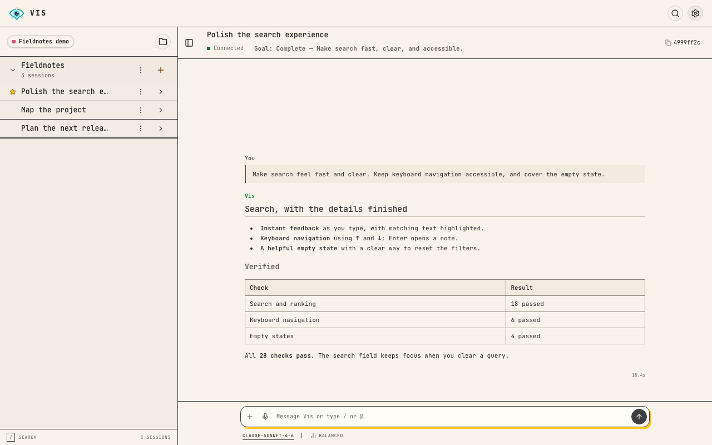</a></td>
    <td align="center"><a href="resources/vis-docs/assets/screenshots/ios-conversation.png">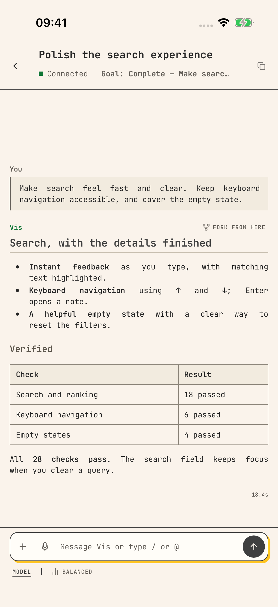</a></td>
    <td align="center"><a href="resources/vis-docs/assets/screenshots/tui-conversation.png">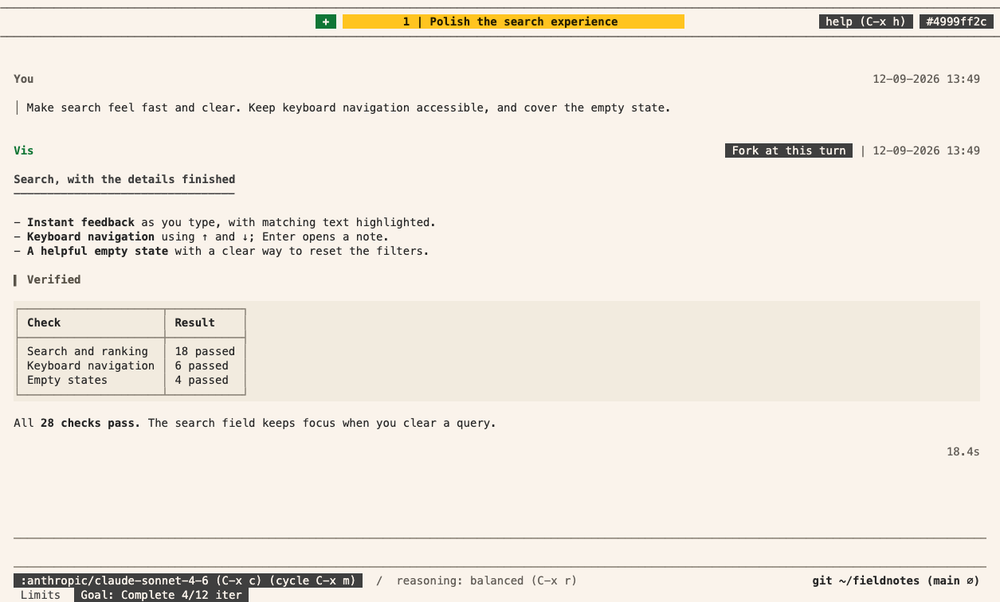</a></td>
  </tr>
  <tr>
    <td align="center"><a href="resources/vis-docs/assets/screenshots/desktop-project.png">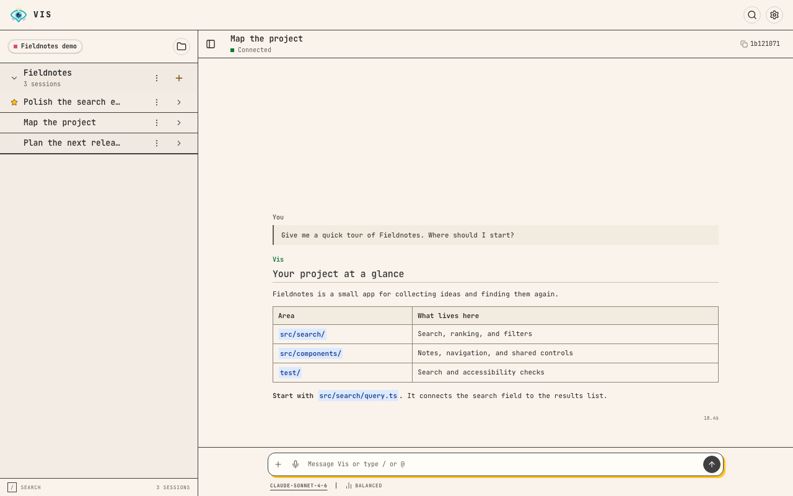</a></td>
    <td align="center"><a href="resources/vis-docs/assets/screenshots/ios-project.png">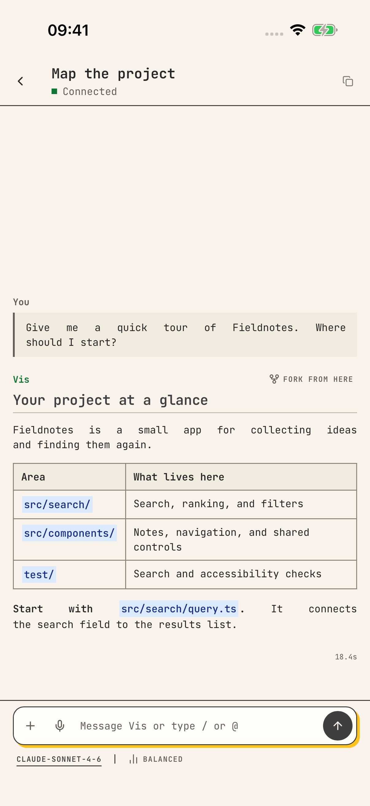</a></td>
    <td align="center"><a href="resources/vis-docs/assets/screenshots/tui-project.png">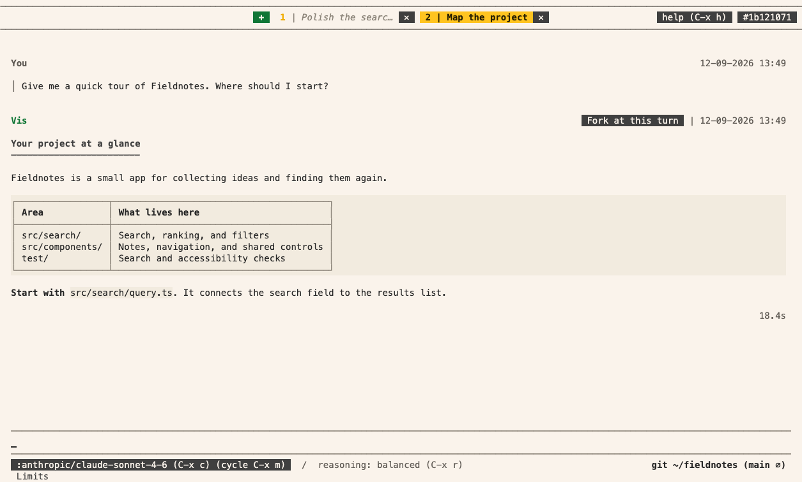</a></td>
  </tr>
  <tr>
    <td align="center"><a href="resources/vis-docs/assets/screenshots/desktop-release.png">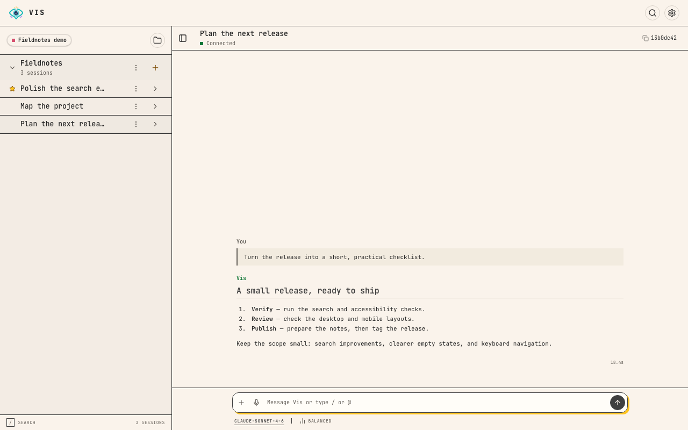</a></td>
    <td align="center"><a href="resources/vis-docs/assets/screenshots/ios-sessions.png">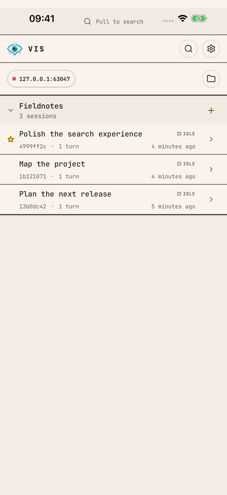</a></td>
    <td align="center"><a href="resources/vis-docs/assets/screenshots/tui-sessions.png">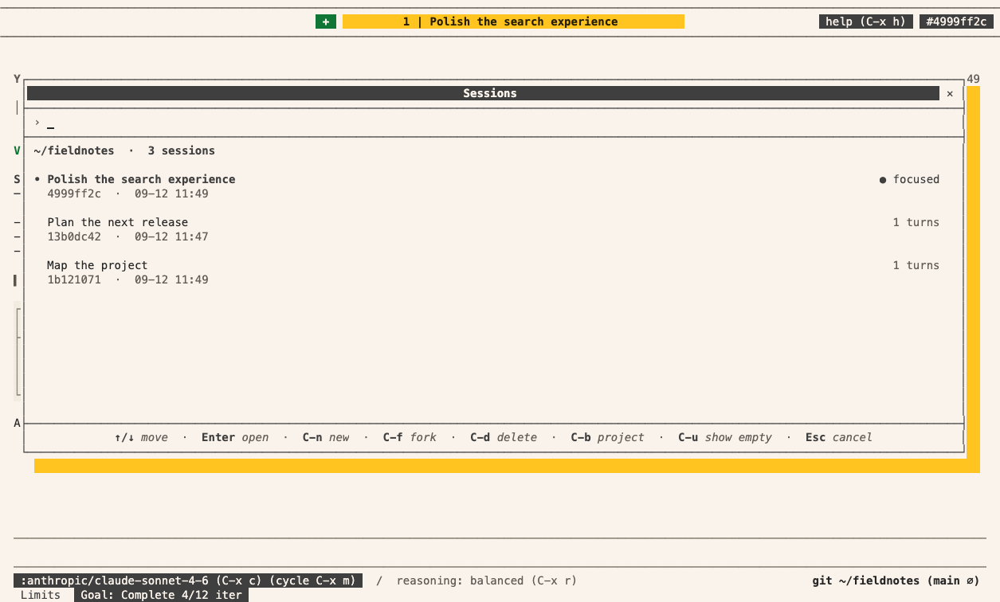</a></td>
  </tr>
</table>

## Install

Install Vis on the computer where your projects live. The default release
includes the engine, Python and terminal client; it does not need Java or Git.
Native packages support Apple silicon macOS and Linux (x64 or ARM64). See
[Runtime distributions](resources/vis-docs/distributions.md) for source builds
and other installation options.

The installer writes to `~/.local/bin` and can update your shell profile. You can
[read it first](https://github.com/Blockether/vis/releases/download/installer/install-vis-agent).

```bash
curl -fsSL https://github.com/Blockether/vis/releases/download/installer/install-vis-agent | bash
```

## Quick start

Open a terminal in your project:

```bash
cd /path/to/project
vis-agent tui
```

Choose a provider, sign in and select a model. Your provider may charge for model
usage; you can also use a supported local model. Try a read-only first task:
“Explain how this project is organized. Don't change any files.”

Vis can edit files and run commands within its configured permissions. Review
changes before using them. The [first-session guide](resources/vis-docs/index.md#first-session)
covers setup and what to expect.

## Desktop app (macOS / Linux)

Download the app from [GitHub Releases](https://github.com/Blockether/vis/releases/latest):
the universal `.dmg` for macOS, or the `.AppImage` matching your Linux architecture.

<p>
<a class="store-macos" href="https://github.com/Blockether/vis/releases/latest">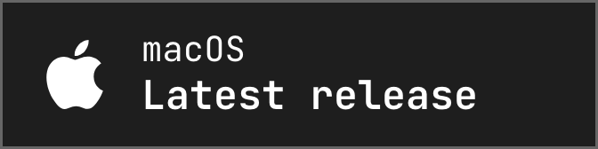</a>
<span aria-hidden="true">&nbsp;&nbsp;</span>
<a class="store-linux" href="https://github.com/Blockether/vis/releases/latest">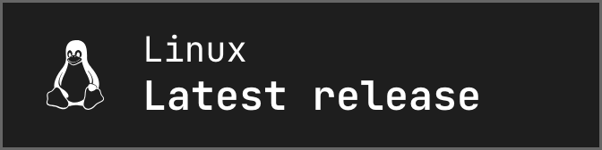</a>
</p>

Already installed the command? `vis-agent desktop --track release` downloads and
opens the stable app for you. The app connects to a **gateway**, the Vis service
running your sessions; opening the app does not start that service.
Follow [Desktop setup](resources/vis-docs/distributions.md#open-the-desktop-app)
and the [app connection guide](resources/vis-docs/index.md#connecting-the-companion-app) to connect it.

## Companion app (iPhone / Android)

Use your phone to check progress or continue a conversation on the same gateway.
Both stores offer public testing without an invitation.

<p>
<a class="store-apple" href="https://testflight.apple.com/join/4anYT4Wk">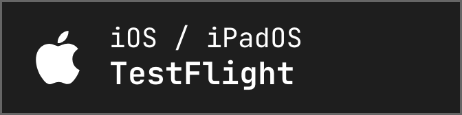</a>
<span aria-hidden="true">&nbsp;&nbsp;</span>
<a class="store-android" href="https://play.google.com/apps/testing/com.blockether.viscompanion">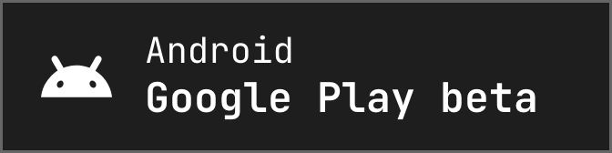</a>
</p>

Follow the [phone pairing guide](resources/vis-docs/index.md#pair-a-phone).
Questions and beta feedback: `contact@blockether.com`.

## Update

```bash
vis-agent update
```

This selects the latest stable release. Preview and source-build updates need
an explicit track; see [updates and release tracks](resources/vis-docs/distributions.md#updating-and-selecting-a-track).

## Native vs JVM

Use the native release for everyday work, or the JVM source build when developing
Vis. The [runtime comparison](resources/vis-docs/distributions.md#native-vs-jvm)
covers requirements, startup time and memory use.

## Use Vis from your code

Start with the [Python SDK](resources/vis-docs/python-sdk.md) to run a task using
`Agent(project=".")`, continue the conversation or connect to a shared gateway.
For JVM applications, follow the [Java and Clojure guide](resources/vis-docs/jvm-sdk.md).
For a shared engine, [run a gateway](resources/vis-docs/gateway-service.md); no native build is needed.

## Add your own tools and checks

Follow [Extending Vis](resources/vis-docs/extending.md) to add a tool for your workflow.
For a working example of an automatic check, see
[Check code complexity after edits](resources/vis-docs/extension-design.md#check-code-complexity-after-edits).
Only when adding Java/Clojure capabilities inside Vis, follow
[Native builds for JVM extensions](resources/vis-docs/jvm-native-image.md).

## License

Apache License 2.0 — see [LICENSE](LICENSE).

The speech service can install third-party models with separate license terms.
[THIRD_PARTY_MODELS.md](THIRD_PARTY_MODELS.md) lists their authors and licenses; it is generated from the installer's model manifest.
