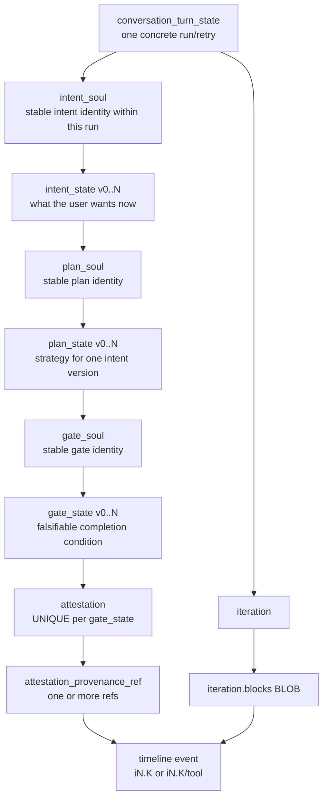
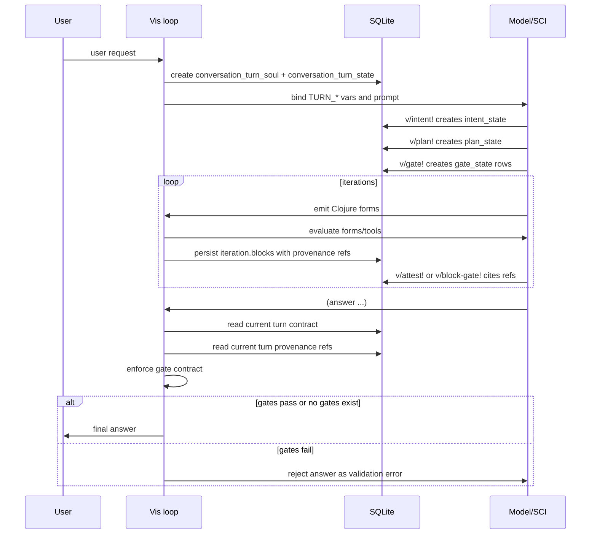
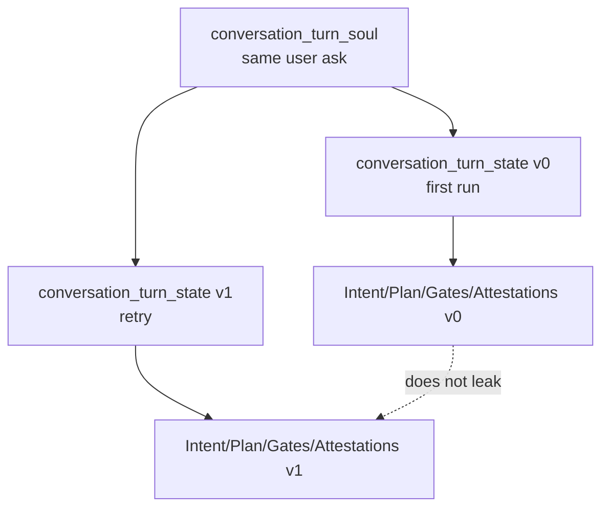

# Completion Contract

Vis uses a turn-scoped completion contract to separate **claims** from **evidence**.

The model must not merely say "done", "verified", or "I inspected it". For non-trivial work it records:

```text
Intent(versioned)
  -> Plan(versioned)
    -> Gate(versioned)
      -> Attestation(exactly one per gate version)
        -> Provenance refs
          -> Timeline events
```

In compact Nucleus notation:

```text
ΩVisContract :=
  Intentᵛ
    → Planᵛ
      → Gateᵛ
        → Attestation¹
          → ProvRef⁺
            → TimelineEvent
```

Legend:

- `ᵛ` — versioned.
- `¹` — exactly one.
- `⁺` — one or more.

## What is what

| Name | What it is | What it is not |
|---|---|---|
| Intent | The current user goal for this concrete turn run/retry. | Not a task list and not conversation history. |
| Plan | The strategy for satisfying one intent version. | Not evidence and not proof that anything happened. |
| Gate | A falsifiable condition that must be closed or blocked before claiming completion. | Not a vague todo like "be careful". |
| Attestation | Exactly one proof/blocker object for exactly one gate version. | Not a free-floating note and not a second gate. |
| Provenance ref | A pointer such as `i2.1` or `i2.1/tool` into observed timeline events. | Not a claim by itself. |
| Timeline event | A recorded eval/tool/guard event that actually happened. | Not proof that the event satisfies a gate. |
| `v/contract` | Read projection that returns the current turn's Intent/Plan/Gate/Attestation rows together. | Not a domain object and not something the model should maintain locally. |

## Why this exists

The contract answers five questions before a final answer is accepted:

1. What does the user want now?
2. How is Vis trying to satisfy it?
3. What must be true before Vis can answer?
4. What evidence proves or blocks each condition?
5. Where did that evidence come from in the current turn timeline?

Without this contract, an answer can hallucinate completion:

```text
"I verified it."
```

With this contract, verification needs data:

```text
Gate:        Did targeted verification pass?
Attestation: Targeted tests passed.
Refs:        ["i5.1/tool"]
Timeline:    i5.1/tool exists in this current turn and succeeded.
```

## Entity model



The important ownership rule:

```text
conversation_turn_state owns intent_soul.
```

Not `conversation_state`, not `conversation_turn_soul`.

A `conversation_turn_soul` is the identity of a user ask. A `conversation_turn_state` is one concrete run/retry of that ask. Retries can have different plans, gates, proofs, and evidence, so the completion contract belongs to the run/retry.

## Intent

An Intent is the current interpretation of the user's request.

Example:

```clojure
(v/intent! {:key :main
            :text TURN_USER_REQUEST
            :created-ref "i1.1"})
```

Intent is versioned because user intent can change during a turn.

Example:

```text
Initial: "Fix the schema diagram."
Later:   "Also add runtime enforcement."
```

The later request does not mutate the old meaning silently. It creates a new `intent_state` version. Plans and gates tied to the old intent do not automatically prove the new one.

## Plan

A Plan is the strategy for satisfying one intent version.

Example:

```clojure
(v/plan! {:intent-state-id (:id intent)
          :key :main
          :summary "Inspect relevant code, patch safely, verify."
          :steps [{:id :inspect}
                  {:id :patch}
                  {:id :verify}]})
```

Plan is versioned because strategy can change when the intent changes or when evidence invalidates the old plan.

## Gate

A Gate is a falsifiable completion condition.

Good gates are checkable:

```clojure
(v/gate! {:plan-state-id (:id plan)
          :key :inspect-schema
          :question "Was the relevant schema inspected before editing?"})

(v/gate! {:plan-state-id (:id plan)
          :key :verify-tests
          :question "Did targeted verification pass?"})
```

A gate is not a vague todo. It is a condition that must become either:

- `closed` — proven by an attestation; or
- `blocked` — blocked by an attestation with a reason.

## Attestation

An Attestation is the proof or blocker for exactly one gate version.

Closed gate:

```clojure
(v/attest! :verify-tests
  {:status :proven
   :summary "Targeted tests passed."
   :refs ["i5.1/tool"]})
```

Blocked gate:

```clojure
(v/block-gate! :verify-tests
  {:reason "Full verification timed out after 1200s."
   :refs ["i7.1/tool"]})
```

There is exactly one attestation per `gate_state`.

The attestation may cite multiple refs, but it belongs to exactly one gate version.

## Provenance refs and timeline events

Provenance refs point into the current turn timeline.

```text
i1.1       first top-level form of iteration 1
i2.3       third top-level form of iteration 2
i4.1/tool  tool result nested under form i4.1
```

Timeline events say what actually happened:

```clojure
{:kind :eval
 :ref "i2.1"
 :op :vis/eval
 :engine :vis/sci
 :status :ok}
```

```clojure
{:kind :tool
 :ref "i2.1/tool"
 :parent-ref "i2.1"
 :op :v/read
 :status :ok}
```

Provenance alone says:

```text
This happened.
```

Attestation says:

```text
This happened, and it proves or blocks this gate.
```

## Runtime lifecycle



## Enforcement

There are three enforcement layers.

### 1. SQLite constraints and triggers

The schema enforces durable shape:

- `intent_soul` belongs to `conversation_turn_state`.
- versions start at `0` and increment by `1`.
- supersedes links stay inside the same soul.
- `plan_state.intent_state_id` must belong to the same intent soul as `plan_soul`.
- `gate_state.plan_state_id` must belong to the same plan soul as `gate_soul`.
- `attestation.gate_state_id` is unique.
- terminal gates require matching attestations with refs.
- terminal gate attestations and refs are immutable.

### 2. Foundation checks

The foundation API exposes read-side checks:

```clojure
(v/gate-checks)
(v/provenance-guards)
```

`v/gate-checks` validates the current `conversation_turn_state` contract:

- active intent exists when gate state exists;
- active plan exists for active intent;
- required gates are not open;
- closed gate has exactly one proven attestation;
- blocked gate has exactly one blocked attestation and a reason;
- attestation refs are non-empty;
- attestation refs resolve in the current turn timeline.

### 3. Final-answer gate

When the model calls `(answer ...)`, the runtime checks the current turn contract.

If no gates exist, answer is allowed. This keeps trivial chat lightweight.

If gates exist, answer is rejected unless the current-turn gate contract passes.

The rejection is surfaced as an ordinary iteration validation error, so the model can observe it, run `(v/gate-checks)`, fix/attest/block the gates, and retry the answer.

## API surface

Main write API:

```clojure
(v/intent! opts)
(v/plan! opts)
(v/gate! opts)
(v/attest! gate opts)
(v/block-gate! gate opts)
```

Read/check API:

```clojure
(v/gates)
(v/attestations)
(v/gate-checks)
(v/gate-report)
(v/contract)
```

`v/contract` is not a domain object. It is a projection helper: the current turn's intent/plan/gate/attestation rows in one map.

`v/contract` is the read projection of the completion contract. The model should manage Intent, Plan, Gate, and Attestation objects. It should not maintain a parallel model-authored `turn-state` map.

## Example flow

### Create contract

```clojure
(def intent
  (v/intent! {:key :main
              :text TURN_USER_REQUEST
              :created-ref "i1.1"}))

(def plan
  (v/plan! {:intent-state-id (:id intent)
            :key :main
            :summary "Inspect relevant code, patch safely, verify."
            :steps [{:id :inspect}
                    {:id :patch}
                    {:id :verify}]}))

(def inspect-gate
  (v/gate! {:plan-state-id (:id plan)
            :key :inspect
            :question "Was relevant code inspected before editing?"}))

(def patch-gate
  (v/gate! {:plan-state-id (:id plan)
            :key :patch
            :question "Was the requested change implemented?"}))

(def verify-gate
  (v/gate! {:plan-state-id (:id plan)
            :key :verify
            :question "Did targeted verification pass?"}))

[intent plan inspect-gate patch-gate verify-gate]
```

### Attest gates

```clojure
(v/attest! :inspect
  {:status :proven
   :summary "Read the relevant schema and persistence code before editing."
   :refs ["i1.1/tool" "i1.2/tool"]})

(v/attest! :patch
  {:status :proven
   :summary "Patched the schema and API."
   :refs ["i3.1/tool"]})

(v/attest! :verify
  {:status :proven
   :summary "Targeted tests passed."
   :refs ["i5.1/tool"]})
```

### Check before answering

```clojure
(def checks
  {:gates (v/gate-checks)
   :provenance (v/provenance-guards)})
checks
```

Only answer after checks pass, or after blocked gates are explicitly represented and reported.

## Versioning and user intent changes

```mermaid
flowchart LR
  I0[Intent v0<br/>"Fix schema diagram"] --> P0[Plan v0]
  P0 --> G0[Gate v0<br/>diagram fixed?]
  G0 --> A0[Attestation v0]

  I0 -. user changes request .-> I1[Intent v1<br/>"Also add runtime enforcement"]
  I1 --> P1[Plan v1]
  P1 --> G1a[Gate v1<br/>diagram fixed?]
  P1 --> G1b[Gate v1<br/>runtime enforcement added?]
  G1a --> A1a[Attestation]
  G1b --> A1b[Attestation]
```

Old attestations do not automatically prove new gates. If the intent or plan changes, create new versions and attest the new gate versions.

## Retry isolation



A retry is a new run. It gets its own completion contract and its own current-turn provenance refs.
