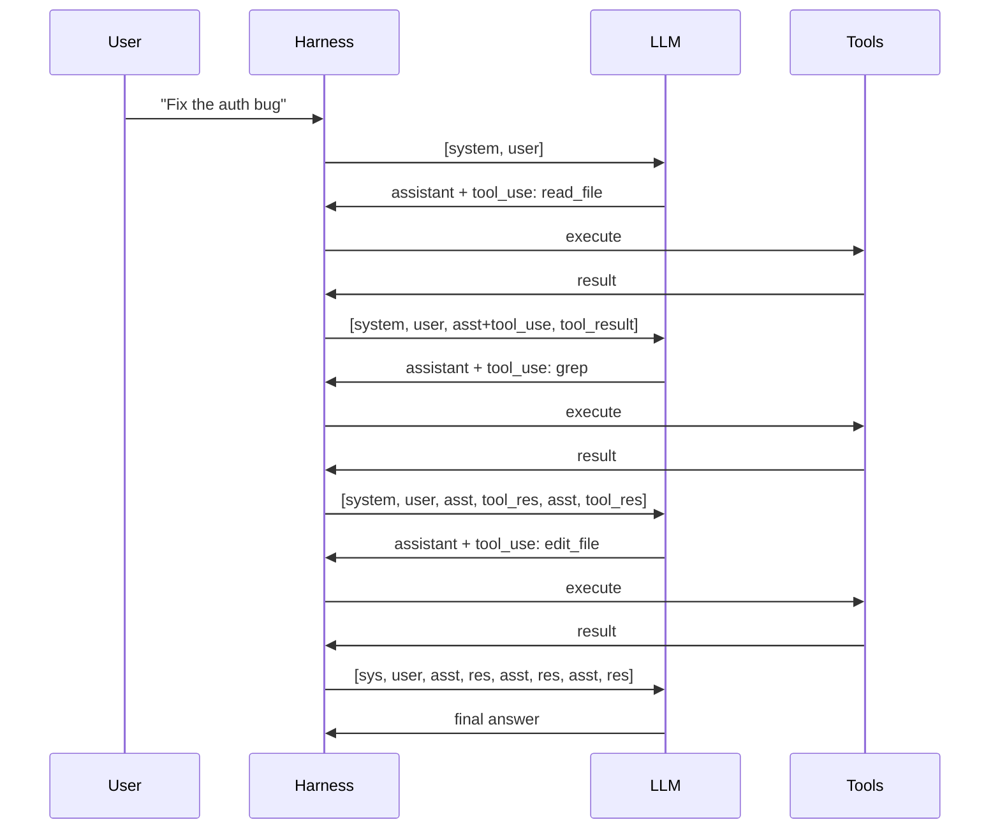
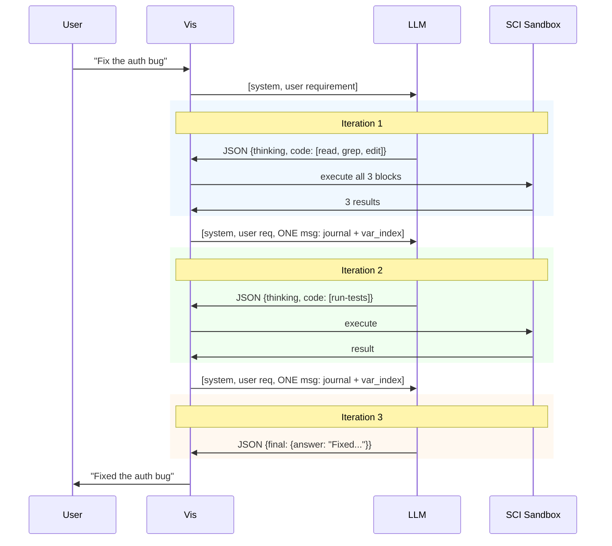

# Rationale

Inspired by [Recursive Language Models](https://arxiv.org/abs/2512.24601)
(Zhang, Kraska & Khattab, 2025). Built from the ground up. Works with
any text-based model.

The model writes Clojure. A sandboxed [SCI](https://github.com/babashka/sci)
interpreter executes it. Results flow back as a compact journal. State
lives in named vars and SQLite, not in the token budget.

## The Problem

Every coding agent (Claude Code, OpenCode, Pi, Hermes) runs the same loop:

Each tool call adds **2 messages** to context (assistant `tool_use` +
`tool_result`). 10 tool calls = 20 messages. Context grows
monotonically. ~80% of tokens end up being tool results the model may
never reference again.

When context fills up: compaction. Summarize old messages, drop results.
Every compaction loses signal. The model forgets, re-reads, forgets.

Other costs: one tool per round-trip (no composition), requires
`function_calling` API support, hallucinated tool names.

## How Vis Works

No tool calls. No message accumulation. No compaction.

| | Tool-call agents | Vis |
|---|---|---|
| **Messages per turn** | 2 per tool call, grows O(n) | 1 per iteration, constant |
| **Context at iter 50** | All 50 iterations accumulated | Same size as iter 1 |
| **Compaction** | Required | Never needed |
| **Ops per LLM call** | N tools (harness-dispatched) | N code blocks (LLM-composed, async-native via futures) |
| **API requirement** | `function_calling` / `tool_use` | Any text-based model |
| **State** | In context window only | Named vars + SQLite |
| **Async** | Harness decides parallelism | LLM decides via `future`/`deref`/`pmap` |
| **Security** | Permission prompts / trust policies | Deny-by-default sandbox, extensions grant access |

The model sees **one context message** per iteration:
- `<journal>` — previous iteration's results (not accumulated)
- `<var_index>` — all named vars rendered as compact pseudo-source, e.g. `(def ^{:v 3 :s :l :t :map :n 12} foo ...)`; `:v` means persisted version count and full history is available via `(var-history 'sym)`
- `[system_nudge]` — budget, repetition, extension hints
- `<prior_thinking>` — previous iteration's reasoning only

Everything older is one function call away: `(var-history 'x)`,
`(conversation-history)`.

## Secure by Default

In tool-call agents, every tool has direct host access. `bash` runs
shell commands. `write_file` writes anywhere. The harness adds
permission prompts ("Allow write to /etc/passwd?") or trust policies.
Security is opt-in, bolted on.

Vis inverts this. The SCI sandbox is a **deny-by-default** environment:

- `eval`, `load-file`, `spit`, `sh`, `*in*`, `*out*` — **blocked**
- File system, network, shell — **no access** unless an extension
  grants it
- Java interop — only classes explicitly exposed (`LocalDate`, `UUID`,
  `Pattern`, etc.)
- Per-block timeout — infinite loops get killed

The model can only do what extensions allow. An extension that registers
`read-file` decides the allowed paths, size caps, and tracking. An
extension that registers `bash` decides which commands are permitted.
No extension = no capability. There are no permission prompts because
there is nothing to permit — the sandbox boundary is the policy.

This is why the [extension system](extensions/overview.md) is the
only way to add capabilities. It's not a plugin architecture for
convenience — it's the security model.

## Why SCI

[SCI](https://github.com/babashka/sci) — sandboxed Clojure interpreter
on the JVM. Full Clojure semantics, deny-list sandboxing, per-block
timeouts, selective Java interop, persistent vars across evaluations.

## What We Took From Others

**Pi** — extension system design (activation guards, lifecycle hooks).
Pi's extensions persist state via `appendEntry()` into JSONL session
files — append-only, per-session, no structured queries. Vis gives
extensions a shared SQLite DB with versioned snapshots, queryable
across conversations.

**Claude Code / OpenCode** — speed matters, permissions kill flow. Vis
uses the sandbox as the permission system.

**Hermes** — ambitious 5-layer memory architecture. But a 10K-line
monolith with undocumented heuristics. Vis keeps every iteration
inspectable with full provenance in SQLite.
