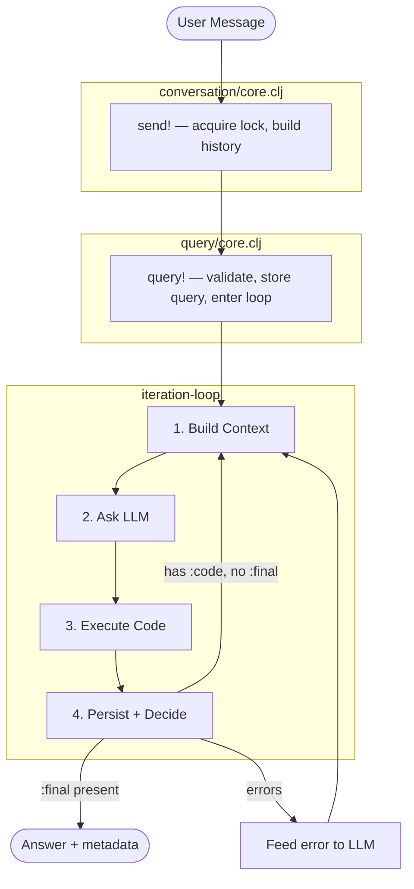
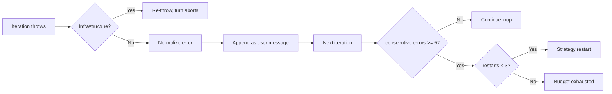

# Iteration Flow

What happens when the user sends a message, end to end.

## Sequence

**Step details:**

1. **Build Context** — iter header, `<prior_thinking>`, `<journal>`, `<var_index>`, nudges (built-in + extension)
2. **Ask LLM** — svar structured JSON output: code blocks + optional `:final`
3. **Execute Code** — lint, SCI eval with timeout, capture stdout/stderr/result per block
4. **Persist + Decide** — `store-iteration!`, attach extension metadata, route to next step

## System Prompt Assembly

`loop-core/assemble-system-prompt` is the **single source of truth** for
the system message content. Both iteration loop paths and the TUI
`[?]` inspector call it. It composes:

1. **Core instructions** (`CORE_SYSTEM_PROMPT`) — iteration steps
   (READ/COMPUTE/PERSIST/FINALIZE), Mustache docs, grounding rule,
   query primacy, perf hints, tool discipline, CLJ rules, output voice
2. **Date + environment block** — CWD, home, user, platform, shell
3. **Extension prompts** — each active extension’s `:ext/prompt`,
   prefixed with `[namespace: alias → ns]`

The iteration spec schema (svar’s `spec->prompt`) is appended separately
by svar as a final user message — it is NOT part of the system message.

## Error Recovery

## Budget Extension

The default budget is **4 iterations** — deliberately tight so the LLM
must plan. When more work is genuinely needed, the LLM calls
`(request-more-iterations n)` from `:code` to extend on demand.
There is **no cap** on how high the budget can grow.

## Prior Thinking

Only the **most recent** iteration's `:thinking` is shipped in
`<prior_thinking>`. Older reasonings are accessible on demand via
`(var-history '*reasoning*)` from `:code`. This is deliberate —
eager auto-context burns tokens on summaries nobody asked for.

Cross-query handover at iteration 0 ships the last 2 reasonings +
final answer from the previous turn. This is a separate mechanism.
