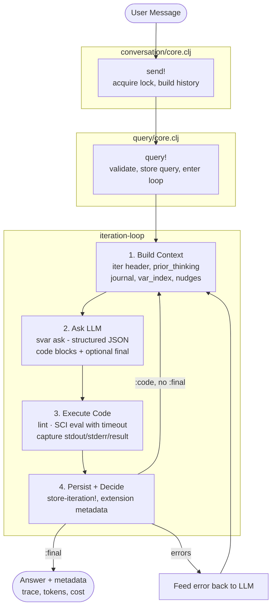
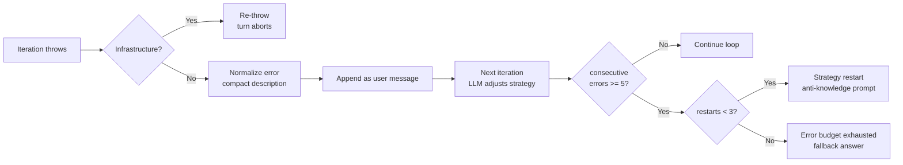

# Iteration Flow

What happens when the user sends a message, end to end.

## Sequence

## Error Recovery

## Budget Extension

The LLM can call `(request-more-iterations n)` from `:code` to extend
its iteration budget at runtime. Each request is capped at
`MAX_EXTENSION_PER_REQUEST` (50), and the total can never exceed
`MAX_ITERATION_CAP` (500).

## Prior Thinking

Only the **most recent** iteration's `:thinking` is shipped in
`<prior_thinking>`. Older reasonings are accessible on demand via
`(var-history '*reasoning*)` from `:code`. This is deliberate —
eager auto-context burns tokens on summaries nobody asked for.

Cross-query handover at iteration 0 ships the last 2 reasonings +
final answer from the previous turn. This is a separate mechanism.
