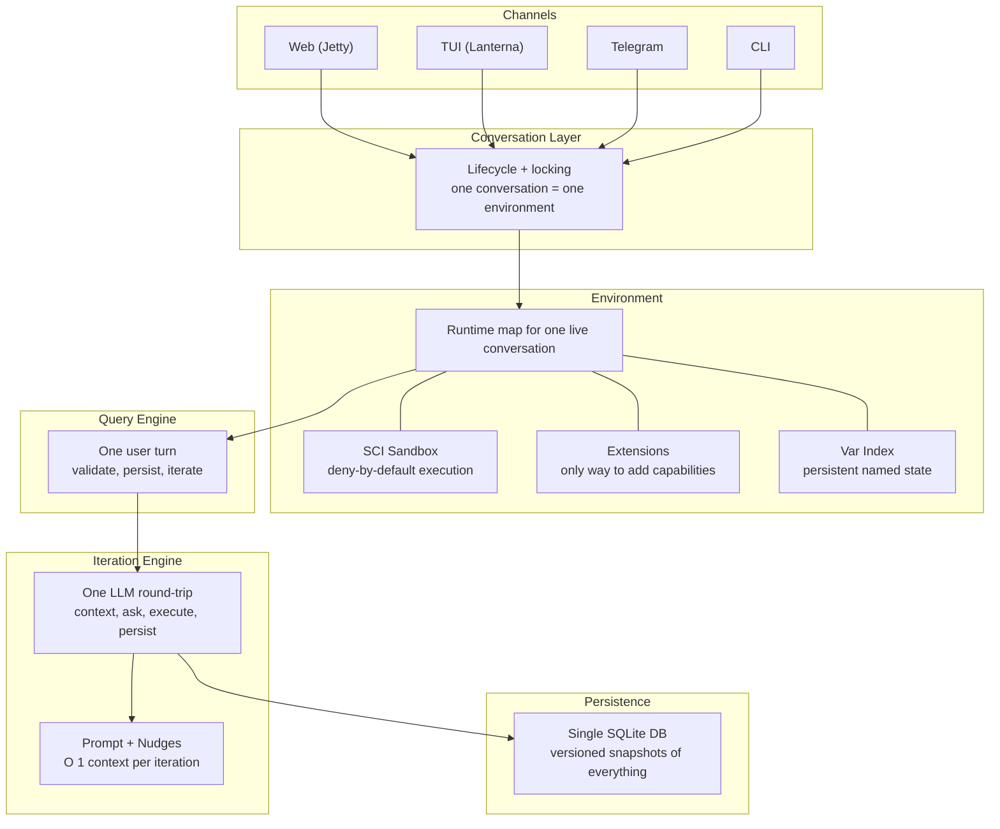

# Architecture Overview

## Layer Responsibilities

**Channels** — external surfaces only. HTTP routes, terminal rendering,
bot polling, CLI argument parsing. No business logic. Each channel calls
into the conversation layer.

**Conversation Layer** — owns the in-process cache of live environments,
per-conversation locking, and the send → query bridge. One conversation
= one environment = one SCI sandbox.

**Environment** — the runtime map representing one live conversation.
Holds the SCI sandbox, registered extensions, var-index cache, DB
handle, and router. See
[Environment Map](../extensions/environment.md) for every key.

**Query Engine** — one user turn. Validates inputs, stores the query
entity, enters the iteration loop, finalizes cost/duration/tokens.

**Iteration Engine** — one LLM round-trip. Assembles context (journal,
var-index, nudges, prior thinking), calls the LLM, executes code blocks
in SCI, persists results. Context is O(1) — never grows with iteration
count. The system prompt is built by `loop-core/assemble-system-prompt`
— single source of truth shared by both loop paths and the TUI inspector.

**Persistence** — single SQLite DB for everything. Every `(def ...)`,
every iteration, every thinking step persisted as versioned snapshots.
Full provenance for post-mortem and conversation resume.
