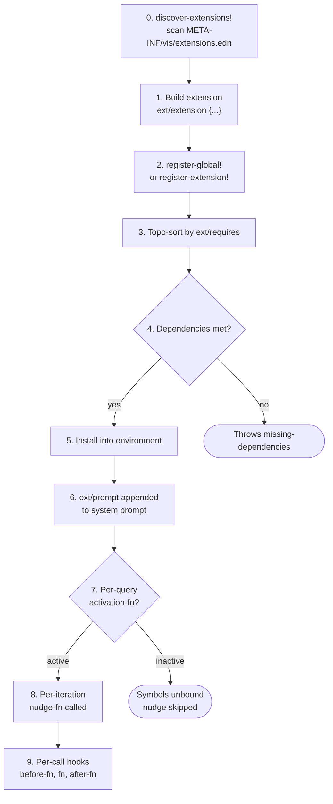

# Extension System

> **Namespace:** `com.blockether.vis.loop.runtime.conversation.environment.extension`

Extensions are the **only** way to add symbols, classes, and documentation
to the SCI sandbox. An extension is a namespace-like bundle that groups
related tools, constants, prompt context, and per-iteration nudges into
a single validated unit.

## What an Extension Can Do

1. **Bind functions** into the sandbox — the LLM calls them from `:code`
2. **Bind constants** — data the LLM can reference by name
3. **Inject prompt context** — LLM-facing docs in the system prompt
4. **Emit per-iteration nudges** — situational hints (budget, errors, etc.)
5. **Expose Java classes** — enable `(LocalDate/now)` style interop
6. **Guard activation** — conditionally enable/disable based on env state

## Registration

Two ways to register extensions:

### Global Registry (recommended)

Call `register-global!` at namespace load time. When any environment
is created, all global extensions are automatically installed in
dependency order.

```clojure
(ns my.company.ext.git
  (:require [....extension :as ext]))

(ext/register-global!
  (ext/extension
    {:ext/namespace 'com.acme.ext.git
     :ext/requires  ['com.blockether.vis.ext.editing]
     :ext/doc       "Git integration"
     ...}))
```

Drop the jar on the classpath → namespace loads → extension
self-registers → every new environment gets it.

### Auto-Discovery from Classpath (recommended)

Extensions can be discovered **automatically** without any manual
`require`. Place a `META-INF/vis/extensions.edn` file in your
extension’s `resources/` directory:

```edn
[com.acme.ext.git
 com.acme.ext.search]
```

When `create-environment` runs, it calls `discover-extensions!` which:

1. Scans the classpath for **all** `META-INF/vis/extensions.edn` files
   (via `ClassLoader.getResources`)
2. Reads each file as a vector of namespace symbols
3. `require`s each namespace (triggering its `register-global!` call)
4. Skips namespaces that are already registered
5. Logs every success at `:info` and every failure at `:error`

This means: add the extension jar/local-root to your deps.edn aliases,
ensure it has a `META-INF/vis/extensions.edn` in its resources, and
it will be loaded automatically. No imports, no requires, no wiring.

**Directory layout for an extension:**

```
extensions/my-ext/
├── deps.edn                         ;; {:paths ["src" "resources"] ...}
├── resources/
│   └── META-INF/vis/extensions.edn   ;; [com.acme.ext.my-tool]
└── src/com/acme/ext/my_tool.clj     ;; calls register-global! at load time
```

**deps.edn alias:**

```clojure
:run {:extra-deps {com.acme.ext/my-tool {:local/root "extensions/my-ext"}}}
```

### Dynamic Loading

An extension can load other extensions at runtime:

```clojure
(ext/load-extension! 'my.company.ext.git)
;; => requires the ns, triggers register-global!, returns the ext
```

This is how meta-extensions (extension packs) work — one extension
`require`s others dynamically.

### Per-Environment (ad-hoc)

```clojure
(register-extension! environment my-ext)
```

For extensions that shouldn't be global.

## Lifecycle



## Namespace Aliases

By default, extension symbols are bound into the `sandbox` namespace
(the LLM’s working namespace). Optionally, an extension can declare
`:ext/ns-alias` to also bind its symbols into a dedicated namespace
with a short alias:

```clojure
(ext/extension
  {:ext/namespace 'com.blockether.vis.ext.editing
   :ext/ns-alias  {:ns 'vis.ext.fs :alias 'fs}
   ...})
```

This lets the LLM call `(fs/read-file "x")` or `(read-file "x")` —
both work. The alias is registered in the SCI context at
`register-extension!` time.

Extension-declared `:ext/classes` and `:ext/imports` are also injected
into the SCI context, so `(LocalDate/now)` works if an extension
exposes `java.time.LocalDate`.

## Prompt Injection

Every active extension’s `:ext/prompt` is appended to the **system
prompt** at the start of each query. This is how the LLM knows which
tools are available in the sandbox.

At query start:
1. Base system prompt is assembled
2. For each extension where `(:ext/activation-fn ext) environment` is truthy:
   - `(:ext/prompt ext) environment` is called
   - If it returns a non-blank string, it’s appended
3. All active prompts are joined with `\n\n` and appended to the system prompt

If an extension’s `activation-fn` or `prompt` fn throws, the error is
logged at `:error` level (with the unified `format-exception-short`
format) and that extension’s prompt is skipped — the query still runs.

## Quick Example

```clojure
(require '[c.b.vis.loop.runtime.conversation.environment.extension :as ext])

(def my-ext
  (ext/extension
    {:ext/namespace     'com.acme.ext.my-tool
     :ext/doc           "My custom tool"
     :ext/group         "tools"
     :ext/requires      ['com.blockether.vis.ext.editing]
     :ext/prompt        "Use (my-tool query) to search things."
     :ext/symbols       [(ext/symbol 'com.acme.ext.my-tool search-fn
                           {:doc "Search for things"
                            :arglists '([query])})]
     :ext/nudge-fn      (fn [{:keys [iteration prev-expressions]}]
                          (when (and (> iteration 5)
                                    (some :timeout? prev-expressions))
                            "[system_nudge] my-tool is timing out. Use smaller queries."))}))

(register-extension! environment my-ext)
```

## Sections

- [Extension Spec](spec.md) — all keys, defaults, validation
- [Hook Protocol](hooks.md) — `:before-fn`, `:after-fn`, `:on-error-fn`
- [Environment Map](environment.md) — every key in the environment
- [Nudge System](nudges.md) — built-in + extension nudges
