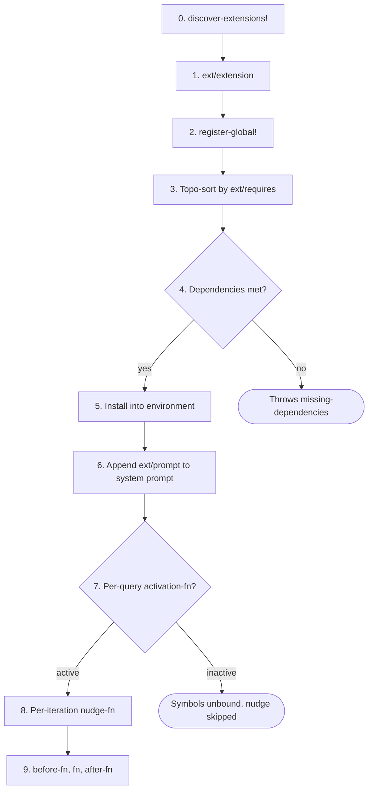

# Extension System

> **Namespace:** `com.blockether.vis.loop.runtime.conversation.environment.extension`
>
> **Public facade:** `com.blockether.vis.core` re-exports the extension
> constructors/registry helpers (`extension`, `symbol`, `value`,
> `render-extension-prompt`, `register-extension!`, etc.) so extension
> authors do not need to require the deep runtime namespace directly.

Extensions are the **only** way to add symbols, classes, and documentation
to the SCI sandbox. An extension is a namespace-like bundle that groups
related tools, constants, prompt context, and per-iteration nudges into
a single validated unit.

## What an Extension Can Do

1. **Bind functions** into an aliased namespace - the LLM calls `(alias/fn ...)` from `:code`
2. **Bind constants** - data the LLM references via the alias prefix
3. **Inject prompt context** - LLM-facing docs in the system prompt
4. **Emit per-iteration nudges** - situational hints (budget, errors, etc.)
5. **Expose Java classes** - enable `(LocalDate/now)` style interop
6. **Guard activation** - conditionally enable/disable based on env state

## Registration

Two ways to register extensions:

### Global Registry (recommended)

Call `register-global!` at namespace load time. When any environment
is created, all global extensions are automatically installed in
dependency order.

```clojure
(ns my.company.ext.git
  (:require [....extension :as ext]))

(ext/register-global!
  (ext/extension
    {:ext/namespace 'com.acme.ext.git
     :ext/requires  ['com.blockether.vis.ext.editing]
     :ext/doc       "Git integration"
     ...}))
```

Drop the jar on the classpath → namespace loads → extension
self-registers → every new environment gets it.

### Auto-Discovery from Classpath (recommended)

Extensions can be discovered **automatically** without any manual
`require`. Place a `META-INF/vis/extensions.edn` file in your
extension's `resources/` directory:

```edn
[com.acme.ext.git
 com.acme.ext.search]
```

When `create-environment` runs, it calls `discover-extensions!` which:

1. Scans the classpath for **all** `META-INF/vis/extensions.edn` files
   (via `ClassLoader.getResources`)
2. Reads each file as a vector of namespace symbols
3. `require`s each namespace (triggering its `register-global!` call)
4. Skips namespaces that are already registered
5. Logs every success at `:info` and every failure at `:error`

This means: add the extension jar/local-root to your deps.edn aliases,
ensure it has a `META-INF/vis/extensions.edn` in its resources, and
it will be loaded automatically. No imports, no requires, no wiring.

**Directory layout for an extension:**

```
extensions/my-ext/
├── deps.edn                         ;; {:paths ["src" "resources"] ...}
├── resources/
│   └── META-INF/vis/extensions.edn   ;; [com.acme.ext.my-tool]
└── src/com/acme/ext/my_tool.clj     ;; calls register-global! at load time
```

**deps.edn alias:**

```clojure
:run {:extra-deps {com.acme.ext/my-tool {:local/root "extensions/my-ext"}}}
```

### Dynamic Loading

An extension can load other extensions at runtime:

```clojure
(ext/load-extension! 'my.company.ext.git)
;; => requires the ns, triggers register-global!, returns the ext
```

This is how meta-extensions (extension packs) work - one extension
`require`s others dynamically.

### Per-Environment (ad-hoc)

```clojure
(register-extension! environment my-ext)
```

For extensions that shouldn't be global.

## Lifecycle



**Step details:**

0. **discover-extensions!** - scan `META-INF/vis/extensions.edn` on classpath
1. **ext/extension** - build and validate extension spec
2. **register-global!** - add to process-level registry
3. **Topo-sort** - order by `:ext/requires` dependencies
4. **Dependencies** - all required extensions must be registered
5. **Install** - bind symbols into aliased SCI namespace, auto-require alias in sandbox
6. **Prompt** - auto-render canonical symbol docs, prepend `[namespace: alias → ns]`, then append optional `:ext/prompt`
7. **Activation** - per-query `activation-fn` check
8. **Nudge** - per-iteration `nudge-fn` called
9. **Hooks** - per-call `before-fn`, `fn`, `after-fn`, `on-error-fn`

## Namespace Aliases (required)

Every extension **must** declare `:ext/ns-alias` - a map with `:ns`
(the full SCI namespace symbol) and `:alias` (the short alias the LLM
uses). Extension symbols are bound **only** into this dedicated
namespace, **never** into the `sandbox` namespace directly. The LLM
must always use the alias prefix.

```clojure
(ext/extension
  {:ext/namespace 'com.blockether.vis.ext.editing
   :ext/ns-alias  {:ns 'vis.ext.fs :alias 'fs}
   ...})
```

At `register-extension!` time:
1. A SCI namespace `vis.ext.fs` is created with all wrapped symbols
2. The alias `fs` is registered in the SCI context
3. `(require '[vis.ext.fs :as fs])` is auto-evaluated in the sandbox
4. The LLM calls `(fs/read-file ...)`, `(fs/list-files ...)`, etc.
5. Bare `(read-file ...)` does **not** resolve - the alias is mandatory

The system prompt auto-prepends a namespace header to each extension's
prompt block:

```
[namespace: fs → vis.ext.fs]
Filesystem tools (use fs/ prefix):
- (fs/read-file path) ...
```

Extension-declared `:ext/classes` and `:ext/imports` are also injected
into the SCI context, so `(LocalDate/now)` works if an extension
exposes `java.time.LocalDate`.

## Prompt Injection

Every active extension contributes a prompt block to the **system
prompt** at the start of each query. This is how the LLM knows which
tools are available in the sandbox.

The canonical tool section is rendered automatically inside the loop
from the extension's `:ext/doc`, `:ext/ns-alias`, and `:ext/symbols`
metadata. `:ext/prompt` is only the optional extra tail appended after
that canonical block.

Use `ext/render-prompt` (or `vis/render-extension-prompt`) when you want
to preview how the canonical block will look.

`loop-core/assemble-system-prompt` is the **single function** that
builds the complete system message. It:

1. Builds the core system prompt (`CORE_SYSTEM_PROMPT` + date +
   environment block + optional caller instructions)
2. Collects extension prompts: for each extension where
   `(:ext/activation-fn ext) environment` is truthy, it renders the
   canonical symbol-derived block and then evaluates `(:ext/prompt ext)`
   when present
3. Joins all active prompt blocks with `\n\n` and appends to the core prompt

Both iteration loop paths (`loop/core.clj` and `query/core.clj`) and
the TUI `[?]` inspector (`conversation/core.clj :: effective-system-prompt`)
call this same function — zero duplication, zero drift.

If an extension's `activation-fn` or `prompt` fn throws, the error is
logged at `:error` level and that extension's prompt is skipped —
the query still runs.

## Quick Example

```clojure
(ns com.acme.ext.search
  (:require [com.blockether.vis.core :as vis]))

(defn- search-fn [query] ...)

(def find-symbol
  (vis/symbol 'find search-fn
    {:doc      "Full-text search."
     :arglists '([query])
     :examples ["(search/find \"neural\")"]}))

(def search-ext
  (vis/extension
    {:ext/namespace     'com.acme.ext.search
     :ext/doc           "Document search"
     :ext/group         "knowledge"
     :ext/ns-alias      {:ns 'vis.ext.search :alias 'search}
     :ext/prompt        "Prefer search before manual file scans."
     :ext/symbols       [find-symbol]}))

;; Self-register at load time
(vis/register-global! search-ext)
```

The LLM sees in the system prompt:

```
[namespace: search → vis.ext.search]
Document search (use search/ prefix)
- (search/find query) — Full-text search.
Prefer search before manual file scans.
```

And calls `(search/find "neural")` from `:code` blocks. Bare
`(find "neural")` does not resolve.

## Sections

- [Extension Spec](spec.md) - all keys, defaults, validation
- [Hook Protocol](hooks.md) - `:before-fn`, `:after-fn`, `:on-error-fn`
- [Environment Map](environment.md) - every key in the environment
- [Nudge System](nudges.md) - built-in + extension nudges
