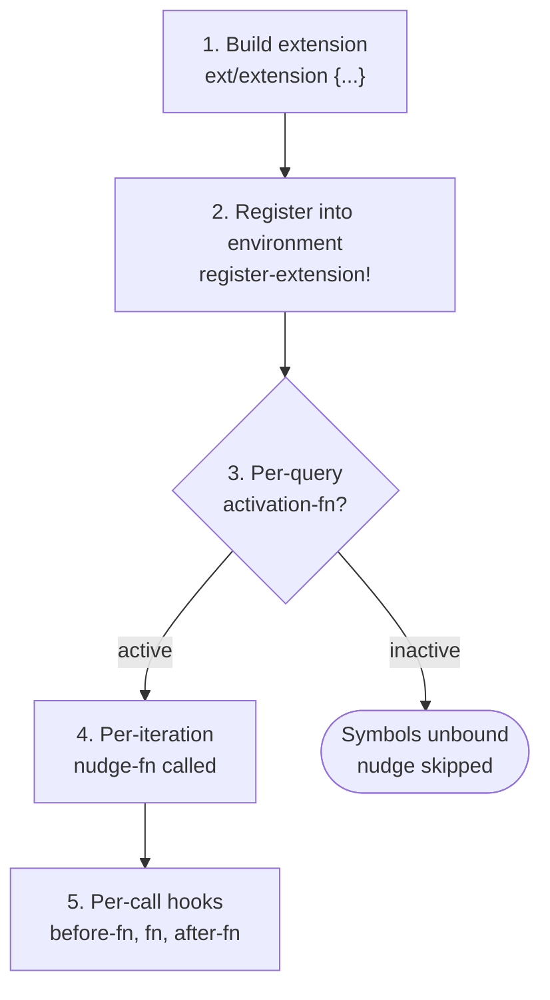

# Extension System

> **Namespace:** `com.blockether.vis.loop.runtime.conversation.environment.extension`

Extensions are the **only** way to add symbols, classes, and documentation
to the SCI sandbox. An extension is a namespace-like bundle that groups
related tools, constants, prompt context, and per-iteration nudges into
a single validated unit.

## What an Extension Can Do

1. **Bind functions** into the sandbox — the LLM calls them from `:code`
2. **Bind constants** — data the LLM can reference by name
3. **Inject prompt context** — LLM-facing docs in the system prompt
4. **Emit per-iteration nudges** — situational hints (budget, errors, etc.)
5. **Expose Java classes** — enable `(LocalDate/now)` style interop
6. **Guard activation** — conditionally enable/disable based on env state

## Lifecycle



## Quick Example

```clojure
(require '[c.b.vis.loop.runtime.conversation.environment.extension :as ext])

(def my-ext
  (ext/extension
    {:ext/namespace     'my-tool
     :ext/doc           "My custom tool"
     :ext/group         "tools"
     :ext/prompt        "Use (my-tool query) to search things."
     :ext/symbols       [(ext/symbol 'my-tool search-fn
                           {:doc "Search for things"
                            :arglists '([query])})]
     :ext/nudge-fn      (fn [{:keys [iteration prev-expressions]}]
                          (when (and (> iteration 5)
                                    (some :timeout? prev-expressions))
                            "[system_nudge] my-tool is timing out. Use smaller queries."))}))

(register-extension! environment my-ext)
```

## Sections

- [Extension Spec](spec.md) — all keys, defaults, validation
- [Hook Protocol](hooks.md) — `:before-fn`, `:after-fn`, `:on-error-fn`
- [Environment Map](environment.md) — every key in the environment
- [Nudge System](nudges.md) — built-in + extension nudges
