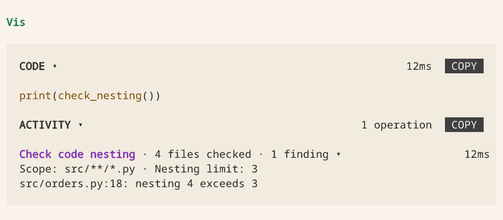
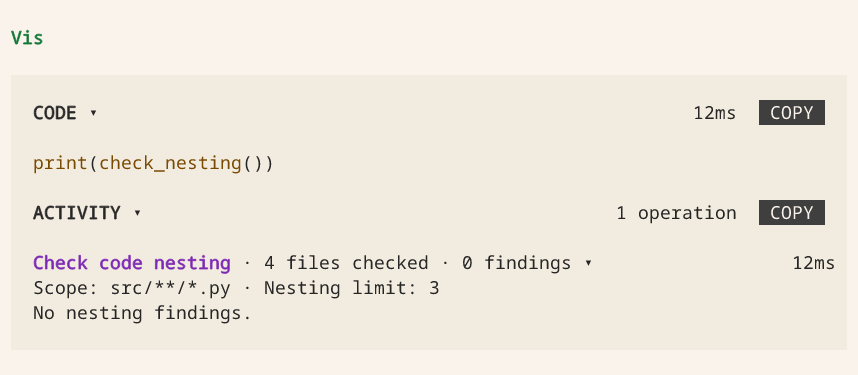

# Extension design

A useful extension gives Vis a clear way to do a job your project needs: run the
right tests, inspect a service or check a result. This guide covers choosing an
operation, explaining its inputs and testing it. Start with the
[one-file tutorial](extending.md), or use the
[tested greeter package](https://github.com/Blockether/vis/tree/main/packages/vis-agent/examples/greeter)
when you need a larger example.

Follow the greeter example from its contract through registration, Activity and
tests. Then try the [CI report](#show-a-ci-report-without-hiding-failures) and
[edit–check–fix cycle](#check-code-complexity-after-edits). The optional
[catalog example](#typed-catalog-and-generated-help) comes last.

## Choose a useful tool boundary

Choose an operation with a clear result, so the agent does not have to rebuild
the same sequence for every call. Return Python values that callers can use
directly, rather than CLI output or JSON text they have to parse. A string is
enough for a text result; a frozen dataclass helps when several fields have
different meanings.

Keep reads separate from mutations. Mark state-changing tools with
`tag="mutation"`, or `@vis.method(tag="mutation")` on a namespace method. The tag
describes the operation; it does not grant permission or enforce a policy.
Validate domain constraints in the implementation and raise a useful exception
when they fail. Type annotations describe the API; they do not validate calls.

## Describe structure once

Use the signature for parameter names and kinds, annotations for types, and prose
for meaning. A callable's nonblank docstring becomes its `doc()` page. Its first
line supplies the short `apropos()` preview, so begin with what the tool does.
Search matches tool names, not that preview: choose names the agent can predict.

A useful tool description answers:

- When should I call this, and what must already be true?
- What does each input mean, including units, limits and omitted values?
- What does the result contain, and what do empty or missing values mean?
- Does the call change anything, request user input or access an external service?
- What failures should the caller handle?

Use `Annotated[T, "meaning"]` for parameter and result-field descriptions. Keep
preconditions, side effects and failure conditions in the docstring. Do not copy
the signature into prose or maintain a second schema. Use
`from __future__ import annotations` and module-level result classes for safely
inspectable annotations on supported Python versions.

The packaged example's `src/vis_greeter/__init__.py` is ordinary Python with no Vis dependency:

```python
"""Ordinary Python code, usable and testable without a Vis session."""

from __future__ import annotations

from dataclasses import dataclass
from typing import Annotated


@dataclass(frozen=True)
class Greeting:
    """The generated greeting, without any external side effects."""

    text: Annotated[str, "Greeting text, ready to display."]
    characters: Annotated[int, "Number of Unicode code points in text, not bytes."]


class Greeter:
    def hello(
        self,
        name: Annotated[str, "Nonblank name of the recipient."],
        *,
        uppercase: bool = False,
    ) -> Greeting:
        """Greet one person. Requires a nonblank name; raises ValueError otherwise.

        uppercase defaults to False, preserving the recipient's capitalization.
        Does not send a message or modify stored state.
        """
        if not name.strip():
            raise ValueError("name must not be blank")
        text = f"Hello, {name.strip()}!"
        if uppercase:
            text = text.upper()
        return Greeting(text, len(text))
```

## Document default behavior

**Explain what happens when an argument is omitted.** A caller needs that behavior,
not merely a statement that the parameter is optional. Public constants belong
in the documentation: `uppercase` defaults to `False` in the example. Test the
omitted-argument call as well as an explicit override so the prose stays accurate.

For contextual defaults, name the resolution rule: for example, “Omitting `repo`
uses the current project's repository.” For `None`, say whether it means automatic
selection, no limit, or absence. Avoid vague phrases such as “uses the default.”

Vis does not automatically export non-`None` default values or call their `repr()`:
a host default can be a credential, client or other private object. This restriction
is not a ban on documenting known public defaults. Write their meaning in the
docstring or `Annotated` description; never copy a resolved credential or environment
value there. The [contract reference](extension-api.md#defaults-and-introspection)
explains `...`, `has_default` and sandbox introspection.

## Keep the entrypoint small

For reusable code, keep business logic in an importable package and registration
in `extension.py`. A CLI, if useful, is another caller of the same functions.
Do not import the entrypoint from domain code, change `sys.path`, or start login,
network requests or background work during registration.

The packaged example connects the implementation to Vis with this entire entrypoint:

```python
"""Vis entrypoint; business logic lives in vis_greeter, not this file."""

import blockether.vis.extension as vis
from vis_greeter import Greeter


def greeting_activity(*, phase, result, **_):
    """Show the greeting and its character count, not the result object's repr."""
    if phase != "success":
        return None
    return vis.ActivityPresentation(
        "Greet person",
        f"{result.characters} characters",
        (vis.ActivityText(result.text[:1000]),),
    )


Greeter.hello = vis.method(
    activity=vis.Activity(
        label="Greet person", show_start=False, render=greeting_activity
    )
)(Greeter.hello)

vis.register(
    vis.Extension(
        name="vis-greeter",
        description="Typed greeting tools and an optional greeting procedure.",
        alias="greet",
        symbols=[vis.Symbol(Greeter(), name="greet")],
    )
)
```

`Symbol(Greeter(), name="greet")` exports `greet.hello(...)`. The public namespace
comes from `Symbol.name`, not `Extension.alias`. Declare import roots in the
[package manifest](extension-packages.md#package-manifest), or use an
[editable project](extension-development.md); do not combine both import strategies
for the same source.

## Design the activity with the tool

Every registered callable owns its Activity presentation, including every public
method in an object namespace. Declare it at the binding, not as a later UI task.
The example decorates `Greeter.hello` in the entrypoint so its ordinary Python
implementation stays independent of Vis.

Someone reading an Activity should understand what happened without knowing
Python method names or result types. Use sentence-case
English labels such as "Greet person" or "Run tests", preserve proper names and
acronyms, and use consistent terminology without profanity or vulgarity. Show a
meaningful target, count or outcome in the summary. Put selected evidence behind
disclosure rather than serializing the returned object. Never change the case of
code, paths or returned content merely to format a label.

Choose whether a person needs to see the operation begin. Fast local reads,
patches and greetings use `show_start=False`: only the end result is visible.
The example uses this policy because generating a greeting is immediate. Slow
work, network requests and user input keep `show_start=True` and can publish
meaningful intermediate updates. The engine always tracks start/end internally;
hiding progress never hides failures, cancellation or the final result.

Test empty results, the chosen start visibility, success, failure and cancellation;
verify that presentation errors cannot change the tool result. The engine supplies
execution state and errors, but no generic result view. Follow the canonical
[Activity API](extension-api.md#activity-presentation) for declarations and limits.

## Give each kind of instruction one owner

| Information | Owner |
| --- | --- |
| A tool's inputs, defaults, result and failure conditions | Its annotations and docstring |
| When to use this extension and where to discover its tools | A short extension `prompt` |
| A multi-step procedure spanning tools | A skill with a clear trigger in its description |
| Project-wide rules | Project instructions, not every tool's prompt |

Link from a skill to `doc("greet.hello")` instead of copying the API reference.
Keep references and templates beside `SKILL.md` and read them when needed.
Installing or reading a skill never executes its procedure or supplies authorization.
See [prompts and discovery](extension-api.md#prompts-and-discovery) and
[bundled skills](extension-packages.md#bundled-skills).

## Test both boundaries

### Test the Python implementation

From a development environment containing the SDK and pytest, run the example's
tests from the copied `greeter/` directory:

```bash
python -m pip install vis-agent pytest
python -m pytest tests
```

Cover the normal result, omitted arguments, explicit overrides, invalid input and
side effects. The example's tests run without a gateway. Use your project's own
test environment; installing the SDK there does not install an extension into Vis.

Outside the engine, `vis.state`, `vis.log` and `vis.shell` use a local host, and
`vis.ask` prompts in the terminal. Supply answers with
`vis.outside.answer_with({...})` or `VIS_OUTSIDE_ANSWERS` JSON. Set
`VIS_OUTSIDE_NONINTERACTIVE=1` to make input requests undeliverable. Session-only
operations cannot be proved by an outside test. For views, use the existing
[LiveRecorder](live-views.md#testing-a-view).

### Test the registered tool

1. [Install the local package](extension-packages.md#install-a-package), then start
   Vis in the target project or run `/reload`.
2. On the next turn, inspect `apropos(r"^greet\.")`, `doc("greet.hello")` and
   `greet.hello.contract`. Confirm the inputs, public default behavior and result fields.
3. Call `await greet.hello("Ada")` and `await greet.hello("Ada", uppercase=True)`.
   Check the returned `.text`, not only registration or the extension list.
4. After an edit, reload and repeat a call. If the last working version was retained
   as stale, resolve the load failure before claiming that the edit works.

The repository's regression suite executes the documented package and loads it
through the real host, including discovery, sandbox results, skill reload and
removal. Your integration also needs a representative call against its own
required dependencies. For tests in Vis's shared environment, use
`vis-agent python -m pytest`, not `vis-agent python pytest`.

## Show a CI report without hiding failures

Use a custom Activity when a raw return value would leave the reader to work out
what happened. This example reads an existing local test summary. It does not
run tests, contact a CI service or check whether the report is current.

After [installing the reader](#install-the-report-reader), ask Vis:

> Read the CI report at `/workspace/ci-report.json` and show the passed and failed counts.

The Activity says **Read CI report**, summarizes **42 passed · 1 failed** and
includes the source path as expandable evidence. The agent still receives a
frozen `CIReport` with all three fields. Reading a report with failing tests is a
successful *read*, not a claim that the tests passed.

With both counts at zero, the summary is **No tests reported**. Missing files,
invalid JSON and invalid counts fail the call; the Activity retains the error
type and message, with a labeled excerpt for long messages. The engine owns the
operation's state, timing and error, independently of this presentation.

### Install the report reader

Prepare a UTF-8 JSON file with this shape; adapt your CI job's output to it if
needed. Counts must be nonnegative integers, not booleans. Extra fields are
ignored.

```json
{"passed": 42, "failed": 1}
```

Save the following as `.vis/extensions/ci_report.py`, then
[reload extensions](extending.md#2-load-it). Only load code you trust:
extensions run in host CPython, not in the agent's sandbox.

```python
# ci_report.py
from __future__ import annotations

import json
from dataclasses import dataclass
from pathlib import Path
from typing import Annotated

import blockether.vis.extension as vis


@dataclass(frozen=True)
class CIReport:
    """Counts from a local report, not evidence of a new test run."""

    path: Annotated[str, "Absolute path of the report that was read."]
    passed: Annotated[int, "Number of passing tests in the report."]
    failed: Annotated[int, "Number of failing tests in the report."]


def read_ci_report(
    path: Annotated[str, "Absolute path to a UTF-8 JSON test summary."],
) -> CIReport:
    """Read a local CI summary without running tests or contacting a service.

    The file must contain a JSON object with nonnegative integer passed and
    failed counts. Zero counts mean no tests were reported, not a passing suite.
    Extra fields are ignored. Relative paths and invalid counts raise ValueError;
    file, encoding and JSON errors propagate. Does not modify the file.
    """
    file = Path(path)
    if not file.is_absolute():
        raise ValueError("path must be absolute")
    data = json.loads(file.read_text(encoding="utf-8"))
    if not isinstance(data, dict):
        raise ValueError("report must be a JSON object")
    for name in ("passed", "failed"):
        value = data.get(name)
        if type(value) is not int or value < 0:
            raise ValueError(f"{name} must be a nonnegative integer")
    return CIReport(str(file), data["passed"], data["failed"])


def present_report(*, phase, result=None, error=None, **_):
    if phase == "start":
        return vis.ActivityPresentation(
            headline="Read CI report", summary="Reading local test results"
        )
    if phase == "failure":
        detail = f"{type(error).__name__}: {error}"
        if len(detail) > 1000:
            detail = detail[:1000] + "\n[Error excerpt]"
        return vis.ActivityPresentation(
            headline="Read CI report",
            summary="Could not read test results",
            content=(vis.ActivityText(detail),),
        )
    summary = (
        f"{result.passed} passed · {result.failed} failed"
        if result.passed or result.failed
        else "No tests reported"
    )
    return vis.ActivityPresentation(
        headline="Read CI report",
        summary=summary,
        content=(vis.ActivityText(f"Source: {result.path}"),),
    )


vis.register(
    vis.Extension(
        name="ci-report-example",
        description="Read local CI summaries with a human-readable Activity.",
        alias="ci",
        symbols=[
            vis.Symbol(
                read_ci_report,
                activity=vis.Activity(
                    label="Read CI report", show_start=False, render=present_report
                ),
            )
        ],
    )
)
```

### Call the report reader

The agent can discover `read_ci_report` and call it directly. For a file at
`/workspace/ci-report.json`, the call is:

```python
report = read_ci_report("/workspace/ci-report.json")
print(report)
```

This quick local read uses `show_start=False`, so it does not display a running
row. The callback handles `start` too: if you adapt the tool to perform slow
work, use `show_start=True` so people can see it begin. Test the adapted tool's
running, success, failure and empty states before publishing it.

## Check code complexity after edits

Suppose your team wants Python code to stay easy to follow. You can ask a skill to
remind the agent to check complexity, but a reminder is not a measurement. Put the
check in an extension hook so it runs at the edit boundary, and give the agent the
findings on its next turn. You decide which metric, threshold and source files
matter to your project.

This example measures **control-flow nesting**, not cyclomatic complexity. It
reports the deepest chain of `if`, loops, `try`, `with` and `match` statements in
each Python file. A new function, class or lambda starts at depth zero; `elif`
counts as another nested `if` in Python's syntax tree. Comprehensions and boolean
expressions do not add depth. The limit of three is an example policy, not a
universal definition of good code.

### See the edit–check–fix cycle

After [installing the check](#install-the-check), ask Vis:

> Update the order-processing code. Show the nesting check, simplify any reported
> nesting, then show the check again. Run the normal tests before finishing.

1. **Edit.** The hook scans `src/**/*.py` at the edit boundaries and supplies
   findings to the agent on its next request.
2. **Check.** The agent calls `check_nesting()` to scan the current files and show
   you a **Check code nesting** Activity. Expand it to see the scope, limit and
   file-and-line findings.
3. **Fix and repeat.** After simplifying the code, the agent calls the check again.
   The new Activity shows the new result; the earlier finding remains in history.

The hook supplies automatic feedback, but does not create its own Activity or
force the agent to fix anything. The registered tool provides the visible check.
It runs a fresh scan, so you can also ask for it before making an edit. This quick
local check uses `show_start=False`: you see the result, not a running row.

These static captures use example results in Vis's actual terminal Activity
renderer, not a separate mockup. Select either image to view it full size.

**Before the fix:** four files checked, with one location above the nesting limit.

[](assets/screenshots/nesting-finding.png)

**After the fix:** the same four files checked, with no nesting findings.

[](assets/screenshots/nesting-clear.png)

A successful Activity means the scan returned a report, not that every file
passed. Findings include parse and read errors; **No Python files found** is a
separate empty state, not a passing check.

### Know what this checks

- `patch` runs the check after a patch operation. A `python_execution` hook also
  runs when the whole Python block returns, including a normal Python error
  after a write. That covers `Path.write_text()` and `with open(..., "w")` too.
  A block that calls `patch` can therefore scan more than once; the report is
  replaced, not accumulated.
- Writes are checked **at these boundaries**, not at every filesystem write.
  Unfinished background processes, a killed interpreter and edits made outside
  Vis are not continuously watched. Wait for any work you start before relying
  on the report, and run your normal checks before accepting changes.
- This is feedback, not a rollback or a security boundary. An after hook cannot
  undo an edit or refuse it after the fact. For a hard rule, validate inside the
  domain operation or use a `before` hook with `vis.block(reason)` on the
  operation you want to refuse. Keep access controls in the sandbox policy and
  repeat acceptance checks in CI. Ordinary tool-hook errors are logged and do
  not block the operation.

### Install the check

For a small Python project with a `src/` directory, save this complete file as
`.vis/extensions/code_quality.py`, then use `/reload`. It needs Python 3.11 or
later, the SDK supplied by Vis and no other packages. Like every extension, it
runs as trusted host code: review it before loading it. Keep `src/` limited to
code you intend to scan, including any linked files.

```python
# code_quality.py
import ast
from pathlib import Path

import blockether.vis.extension as vis

PROJECT = Path(__file__).resolve().parents[2]
SOURCE = PROJECT / "src"
LIMIT = 3
REPORT_KEY = f"nesting:{PROJECT}"
SCOPES = (ast.FunctionDef, ast.AsyncFunctionDef, ast.ClassDef, ast.Lambda)
BRANCHES = (
    ast.If,
    ast.For,
    ast.AsyncFor,
    ast.While,
    ast.Try,
    ast.TryStar,
    ast.With,
    ast.AsyncWith,
    ast.Match,
)


def deepest(node, depth=0):
    """Return the greatest control-flow depth and its first source line."""
    if isinstance(node, SCOPES):
        depth = 0
    if isinstance(node, BRANCHES):
        depth += 1
    best = (depth, getattr(node, "lineno", 1))
    for child in ast.iter_child_nodes(node):
        candidate = deepest(child, depth)
        if candidate[0] > best[0]:
            best = candidate
    return best


def scan():
    findings = []
    checked = 0
    try:
        if not SOURCE.is_dir():
            raise OSError("Expected a readable src/ directory.")
        for path in sorted(SOURCE.rglob("*.py")):
            label = str(path.relative_to(PROJECT))
            try:
                depth, line = deepest(ast.parse(path.read_bytes(), filename=label))
            except (OSError, SyntaxError, ValueError, RecursionError) as error:
                findings.append(f"{label}: could not check: {error}")
                continue
            checked += 1
            if depth > LIMIT:
                findings.append(f"{label}:{line}: nesting {depth} exceeds {LIMIT}")
    except OSError as error:
        findings.append(f"Could not scan src/: {error}")
    return {"checked": checked, "limit": LIMIT, "findings": findings}


def check_nesting() -> dict:
    """Scan this project's src/**/*.py and return checked, limit and findings.

    Uses the nesting metric and limit defined in this extension. Parse and read
    errors are findings; zero checked files is not evidence of a passing check.
    Stores the fresh report for the next model request. Does not modify source
    files, run tests or guarantee overall code quality.
    """
    report = scan()
    vis.state[REPORT_KEY] = report
    return report


def present_nesting(*, phase, result=None, error=None, **_):
    headline = "Check code nesting"
    if phase == "start":
        return vis.ActivityPresentation(headline, "Scanning src/**/*.py")
    if phase == "failure":
        detail = f"{type(error).__name__}: {error}"
        if len(detail) > 1000:
            detail = detail[:1000] + "\n[Error excerpt]"
        return vis.ActivityPresentation(
            headline, "Could not check code nesting", (vis.ActivityText(detail),)
        )
    checked, findings = result["checked"], result["findings"]
    files = "file" if checked == 1 else "files"
    issues = "finding" if len(findings) == 1 else "findings"
    summary = f"{checked} {files} checked · {len(findings)} {issues}"
    if not checked and not findings:
        summary = "No Python files found"
    detail = "\n".join(findings) or (
        "No nesting findings." if checked else "Add Python source files under src/."
    )
    if len(detail) > 6000:
        detail = (
            detail[:6000] + "\n[Excerpt; full findings are in the returned report.]"
        )
    return vis.ActivityPresentation(
        headline,
        summary,
        (
            vis.ActivityText(f"Scope: src/**/*.py · Nesting limit: {result['limit']}"),
            vis.ActivityText(detail),
        ),
    )


def after_edit(call):
    check_nesting()


def context(env):
    return {
        "code_quality": vis.state.get(
            REPORT_KEY, {"findings": ["Nesting has not been checked yet."]}
        )
    }


vis.register(
    vis.Extension(
        name="project-nesting",
        description="Report excessive Python control-flow nesting after edits.",
        alias="quality",
        symbols=[
            vis.Symbol(
                check_nesting,
                activity=vis.Activity(
                    label="Check code nesting", show_start=False, render=present_nesting
                ),
            )
        ],
        ctx=context,
        op_hooks=[vis.OpHook(["patch", "python_execution"], after_edit, phase="after")],
    )
)
```

The callback reads the current files, not the text of the tool call. It scans all
`src/**/*.py` files each time, so new files, deletions and several writes in one
block are included without trying to parse Python write commands. For a large
repository, narrow the scope or move this work into your existing analyzer.

### Use the findings

The hook supplies the report on the next model request as a
`session["code_quality"]` contribution such as:

```python
{
    "checked": 4,
    "limit": 3,
    "findings": ["src/orders.py:18: nesting 4 exceeds 3"],
}
```

The agent can show you a fresh result with the registered tool:

```python
print(check_nesting())
```

The file and line tell it where to review the change. It can flatten a branch or
extract a focused function, then inspect the next report. A parse or read error
is a finding, not a passing check. An empty `findings` list means the scanned
files passed this metric; it says nothing about tests or overall code quality.
The SDK's `vis.state` stores the report per project, and `ctx` supplies it on the
next model request. Returning text from an after hook would not do that: its
return value is ignored.

The repository tests execute this exact extension through the SDK and the host:
patching, both Python write forms, a write followed by an exception, and clearing
findings after a fix. They also invoke the registered check and verify its
end-only Activity, findings, clear results and empty source tree. The metric has
tests for scope boundaries, syntax errors and missing source directories.

## Typed catalog and generated help

Use a catalog when you want structured tool descriptions and generated help for
Vis and other Python callers. This optional example reuses your existing tool
contracts; you do not need a catalog to register tools.

`vis.Catalog(symbols)` is an immutable-data adapter over the same `Symbol` contracts
used for registration. It is not a second registry. `spec()` returns typed top-level
entries; `spec("counter.write")` returns a `ToolSpec`; `help("counter.write")` returns
`HelpDocument(tool, text)`. A namespace's `members` retain full public names, including
nested capabilities. Hidden tools are excluded. A wrong name type raises `TypeError`;
an unknown or hidden name raises `ValueError`. Discovery does not validate configuration,
authenticate, create files or call the described tools.

This complete, tested entrypoint includes a read and a mutation. Both ordinary Python
callers and Vis invoke the same methods. An optional CLI should call those methods too,
not parse generated help. No CLI framework or inheritance is required.

```python
# counter.py
from __future__ import annotations

from dataclasses import dataclass
from pathlib import Path
from typing import Annotated

import blockether.vis.extension as vis


@dataclass(frozen=True, slots=True)
class Count:
    """The nonnegative count stored in a caller-owned file."""

    value: Annotated[int, "Number of completed items."]


class CounterError(RuntimeError):
    """The file could not be read or written; no success result is returned."""


def present_count(*, phase, result=None, error=None, **_):
    if phase == "failure":
        return vis.ActivityPresentation("Counter", str(error))
    if phase == "start":
        return vis.ActivityPresentation("Counter", "Accessing the count file")
    return vis.ActivityPresentation("Counter", f"{result.value} completed items")


class Counter:
    @vis.method(activity=vis.Activity(label="Read counter", show_start=False, render=present_count))
    def read(self, path: Annotated[str, "Caller-owned UTF-8 count file."]) -> Count:
        """Read a count; a missing file means zero. Does not create files.

        Raises TypeError for a non-string path, ValueError for a blank path,
        and CounterError for unreadable or invalid stored data.
        """
        self._validate_path(path)
        try:
            value = int(Path(path).read_text(encoding="utf-8"))
            if value < 0:
                raise ValueError("Stored count must be nonnegative")
            return Count(value)
        except FileNotFoundError:
            return Count(0)
        except (OSError, ValueError) as error:
            raise CounterError("Cannot read count") from error

    @vis.method(tag="mutation", activity=vis.Activity(label="Write counter", show_start=False, render=present_count))
    def write(self, path: str, *, value: Annotated[int, "Nonnegative completed-item count."]) -> Count:
        """Replace the caller-owned file's count; its parent directory must exist.

        Validate before IO: wrong types raise TypeError; blank paths and negative
        counts raise ValueError. Write failures raise CounterError. No retries.
        """
        self._validate_path(path)
        if type(value) is not int:
            raise TypeError("value must be an integer")
        if value < 0:
            raise ValueError("value must be nonnegative")
        try:
            Path(path).write_text(str(value) + "\n", encoding="utf-8")
        except OSError as error:
            raise CounterError("Cannot write count") from error
        return Count(value)

    def _validate_path(self, path):
        if not isinstance(path, str):
            raise TypeError("path must be a string")
        if not path.strip():
            raise ValueError("path must not be blank")


symbols = (vis.Symbol(Counter(), name="counter"),)
catalog = vis.Catalog(symbols)
vis.register(vis.Extension(
    name="counter-example", description="A counter with generated tool help.",
    alias="counter", symbols=(*symbols, vis.Symbol(catalog, name="doctor")),
))
```

The same callable metadata supplies structured values, generated help and Vis `doc()`.
`ParameterSpec` preserves parameter kind, requiredness, `has_default` and
`default_is_none`; it never contains the actual default value. `TypeSpec` recursively
describes result fields, containers, literals and `Annotated` meaning. Records and
nested collections returned by the catalog are frozen dataclasses and tuples. Rebuild
a catalog when declarations change; lookup does not inspect mutable runtime state.

In Vis, inspect `await doctor.spec("counter.write")` and
`await doctor.help("counter.write")`, then compare `doc("counter.write")`. The catalog
covers the `symbols` passed to it; the separate `doctor` discovery adapter is not itself
in that snapshot. Test the same scope against the actual registered public names:

```python
vis.testing.assert_catalog(
    catalog,
    names=["counter.read", "counter.write"],
    mutations=["counter.write"],
)
```

`assert_catalog` checks name and mutation parity, generated help and unresolved types,
including decorated methods and nested result fields. It allows explicitly opaque or
`Any` data; it is not a runtime type checker. Pass names obtained from registration or
`apropos()` in integration tests, rather than treating successful construction as proof.
Also invoke registered tools, test keyword-only binding, invalid input before IO,
operational exceptions and result immutability. The SDK suite executes the code above
and the real host verifies `spec`, `help`, `doc`, discovery and invocation together.

For long-running observations, use the [synchronous monitoring recipe](live-views.md#monitor-a-fixed-build-set)
and its cancellation tests. Catalog inspection must not start its readers. The catalog
regression also invokes that registered observation, cancels it and checks reader cleanup;
cancellation is never converted into a successful observation. Activity is the human
presentation, not a replacement for typed result data. Serialize only at a transport edge.

## See also

- [Extension API](extension-api.md) — exact declarations, contracts and callback rules.
- [Using an existing Python project](extension-development.md) — editable imports and dependency preparation.
- [Installing and sharing extensions](extension-packages.md) — the distributable package layout.
