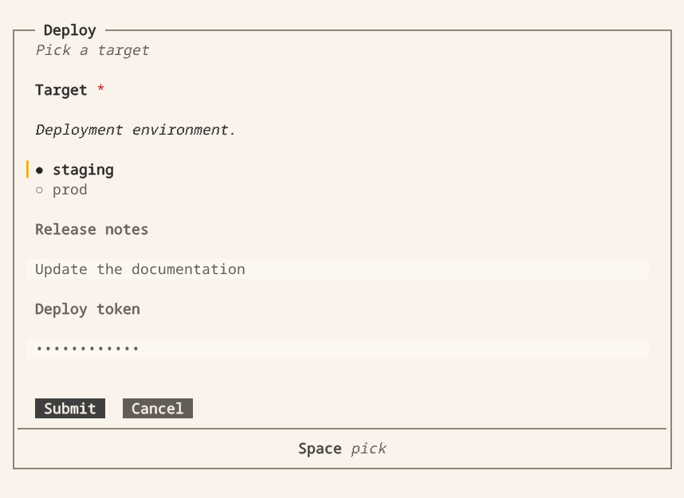

# Asking the human

`vis.ask` pauses a Python extension, displays a form in the terminal or
Companion app, and returns the answer. This page describes fields, layout,
validation and results.

## Before you start

Use `vis.ask` inside a registered tool, user command or session-bound hook. In Vis,
it needs the calling session and an available TUI or Companion client. Do not ask
during registration or from a passive provider callback. Outside Vis, the SDK uses
terminal input; see [testing outside Vis](extension-design.md#test-the-python-implementation).

## Ask and handle cancellation

This fragment belongs inside your tool's implementation. Import
`blockether.vis.extension as vis` in that module and supply your own `deploy`
function. The form does not deploy anything by itself; call the operation only
after a submitted answer and handle cancellation explicitly.

```python
answer = vis.ask("Deploy", [
    {"name": "env", "label": "Target", "description": "Deployment environment.",
     "type": "select", "options": ["staging", "prod"], "is_required": True},
    {"name": "notes", "type": "multiline", "label": "Release notes"},
    {"name": "token", "type": "password", "label": "Deploy token"},
], description="Pick a target", timeout_ms=120000)

if answer:                       # false when cancelled, timed out or undeliverable
    deploy(answer["env"], answer.reveal("token"))
else:
    vis.log("info", "deploy skipped: " + answer.reason)
```

The request opens this form in the Vis terminal. Select a target, enter
notes and submit; the extension resumes with the answer. Password input stays
masked. This capture uses example data. Select the image to view it full size.

[](assets/screenshots/ask.png)

Request options:

| Option | Meaning |
| --- | --- |
| `description` | Text under the title. |
| `submit_label`, `cancel_label` | Button labels. |
| `is_cancellable` | `False` removes the cancel button. |
| `timeout_ms` | 5 minutes by default; `0` waits until the person answers or cancels. |

Every key is a snake_case string (`is_required`, `max_length`, `timeout_ms`).
A camelCase or kebab-case key is refused with an error naming the right
spelling. Unknown keys are refused by name.

## The answer

`vis.ask` never raises for a refusal. It returns an `Answer` that is truthy
when the person confirmed:

| Attribute | Meaning |
| --- | --- |
| `answer.values` | every field's value, defaults included; `answer["env"]` reads one |
| `answer.reason` | `cancelled`, `timeout`, `undeliverable` or the host's reason when the answer is falsy |
| `answer.reveal(name)` | resolve a secret handle in process |

A `password` or `otp` field returns an opaque `vis-secret:` handle. Only the
handle is recorded in the transcript and logs or sent to the model. Retrieve
the value with `answer.reveal(name)` or `vis.reveal(handle)` when needed;
`vis.forget(handle)` removes it. Do not print or log the revealed value.

If no client can display the dialog, the request immediately returns
`undeliverable` and logs an error rather than waiting for the timeout.

## Fields

A field has a `name` (the key in `answer.values`), a `label` shown above the
input and an optional `description` shown under the label. `id` is accepted as
an alias for `name`.

| `type` | Answers with | Notes |
| --- | --- | --- |
| `plaintext` | string | the default type |
| `password` | secret handle | shown as dots |
| `multiline` | string | |
| `select` | one option value | exclusive: exactly one option, never none |
| `multiselect` | list of option values, in declared order | inclusive: any number; empty is legal unless required |
| `checkbox` | `true` or `false` | a required checkbox must be ticked |
| `range` | number | `min` (0), `max` (100), `step` (1); an out-of-range value is refused |
| `otp` | secret handle | digits only, one box per digit; `min_length`/`max_length` set the length (default 6, at most 12) |

Common keys: `placeholder`, `default`, `is_required`, `min_length`,
`max_length`, `validate`, and `options` for the two select types. An option is
a string, or `{"value": ..., "label": ...}` when the stored value and the shown
text differ. An answer naming an undeclared option is refused.

The engine enforces `is_required`. It rejects blank required fields on
confirmation, whether the answer comes from a dialog or an HTTP request.

## Layout

Layout nodes do not produce answer values. A `group` arranges `fields` in a
`column` (default) or `row` and can contain nested groups. A `heading` or
`paragraph` displays `text`.

```python
vis.ask("Where should the pool connect?", [
    {"type": "heading", "text": "Server"},
    {"type": "group", "direction": "row", "fields": [
        {"name": "host", "label": "Host", "is_required": True},
        {"name": "port", "label": "Port"},
    ]},
    {"type": "paragraph", "text": "TLS is required outside the office network."},
    {"name": "tls", "label": "Require TLS", "type": "checkbox"},
])
```

`answer.values` is a flat map keyed by field name, regardless of layout. Names
must be unique. Groups reject value keys (`default`, `options`, `validate`);
fields reject layout keys (`fields`, `direction`). Headings and paragraphs
cannot receive focus and do not appear in the answer.

## Builders

Each node type has a builder that validates its arguments:

```python
form = vis.column(
    vis.heading("Target"),
    vis.paragraph("Staging does not send on-call alerts."),
    vis.row(
        vis.select("env", [vis.option("staging", "Staging"), vis.option("prod")],
                   is_required=True),
        vis.slider("canary", label="Canary %", min=0, max=100, step=5, default=10),
    ),
    vis.checkbox("ack", label="I read the runbook", is_required=True),
    vis.password("token", label="Deploy token", is_required=True),
)

answer = vis.ask("Deploy", [form], submit_label="Deploy")
```

Builders: `plaintext`, `password`, `multiline`, `select`, `multiselect`,
`checkbox`, `slider` (the `range` field, named to avoid the builtin), `otp`,
`option`, `row`, `column`, `heading` and `paragraph`. Keyword arguments are the
field keys above.

## Validation

`validate` is a function, or a list of functions run in order until one
refuses. A validator receives the coerced value, or the value and the flat map
of every answer, and returns `None` or `True` to accept or a message string to
refuse. This fragment assumes your module imports `re` and defines `is_free`, a
validator returning `None` for an available slug or an error message otherwise:

```python
def a_slug(text):
    if not re.fullmatch(r"[a-z][a-z0-9-]*", text):
        return "lowercase, digits and dashes"


answer = vis.ask("Sign up", [
    vis.plaintext("slug", label="Project", validate=[a_slug, is_free]),
    vis.password("pass", label="Password",
                 validate=lambda text: "at least 12 characters" if len(text) < 12 else None),
    vis.password("again", label="Repeat it",
                 validate=lambda text, values:
                     None if text == values["pass"] else "the two do not match"),
])
```

- A validator with any other signature, or a non-function such as a regex
  string, is refused when the request is built.
- `False` refuses with `is not valid`; a validator that raises refuses with
  `could not be validated: <exception>`.
- Validators do not run on blank answers; use `is_required` to reject them.
- Validation runs in the engine on confirmation. The dialog displays each
  field's error message. Validator functions are not sent to clients.

## See also

- [Extending Vis](extending.md) — the extension that calls `vis.ask`.
- [Live views](live-views.md) — display progress while an extension runs.
