Use Vis to explore a project, change code and run checks.
Start in your terminal, or connect the desktop or phone app.

<nav class="quick-links" aria-label="Getting started">
  <a href="#install">Install</a>
  <a href="#first-session">Try a task</a>
  <a href="#connect-an-app">Connect an app</a>
</nav>

## Install

### Install Vis where your work runs

Install Vis on the computer with your project. Native packages support
Apple silicon macOS and Linux (x64 or ARM64). On Windows, use Linux in WSL2.
For other platforms or source builds, see [Runtime distributions](distributions.md).

The installer needs `curl` and `tar`, but not Java or Git.
It writes to `~/.local/bin` and can update your shell profile.
[Read the installer](https://github.com/Blockether/vis/releases/download/installer/install-vis-agent) before running it:

```bash
curl -fsSL https://github.com/Blockether/vis/releases/download/installer/install-vis-agent | bash
```

The desktop and phone apps connect to this engine. They do not run it themselves.

### Get the desktop app

Use the buttons below to download Vis for Windows x64, universal macOS, or Linux x64.
For Linux ARM64, [download the AppImage](https://github.com/Blockether/vis/releases/download/v0.2.30/vis-companion-0.2.30-linux-arm64.AppImage). You can also browse all packages
on the [latest GitHub release](https://github.com/Blockether/vis/releases/latest).

<div class="store-links" aria-label="Download the desktop app">
<a class="store-windows" href="https://github.com/Blockether/vis/releases/download/v0.2.30/vis-companion-0.2.30-windows-x64.msi">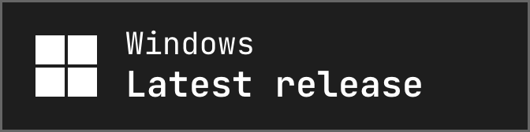</a>
<span aria-hidden="true">&nbsp;&nbsp;</span>
<a class="store-macos" href="https://github.com/Blockether/vis/releases/download/v0.2.30/vis-companion-0.2.30-macos-universal.dmg">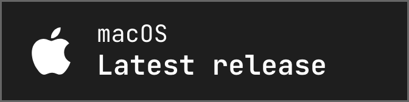</a>
<span aria-hidden="true">&nbsp;&nbsp;</span>
<a class="store-linux" href="https://github.com/Blockether/vis/releases/download/v0.2.30/vis-companion-0.2.30-linux-x64.AppImage">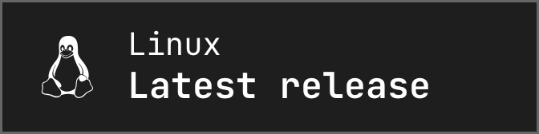</a>
</div>

Install the package, open Vis, then follow the [connection steps below](#connect-an-app).
See [Desktop setup](distributions.md#open-the-desktop-app) for installation and launcher options.

<span id="get-the-phone-app"></span>

### iPhone, iPad and Android

These apps are public betas.
After installing one, [connect it](#pair-a-phone).

<div class="store-links" aria-label="Install the Companion app">
<a class="store-apple" href="https://testflight.apple.com/join/4anYT4Wk">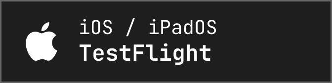</a>
<span aria-hidden="true">&nbsp;&nbsp;</span>
<a class="store-android" href="https://play.google.com/apps/testing/com.blockether.viscompanion">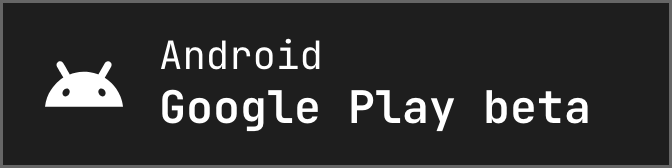</a>
</div>

## First session

Choose a provider and model before sending a task. A provider may need an account
or API key and may charge for use. You can also use Ollama or LM Studio for a local model.
See [Providers and models](configuration.md#providers-and-models).

Vis can edit files and run commands. Start with a read-only task while you get familiar with it.

### In the terminal

Open a terminal in your project:

```bash
cd /path/to/project
vis-agent tui
```

Vis starts a local gateway if needed.

1. Add a provider in the provider picker.
2. Follow its sign-in instructions.
3. Select a model.

Press **Enter** to send a message. See [Keyboard shortcuts](keyboard-shortcuts.md)
for new lines and other keys.

### In the desktop or phone app

[Connect the app](#connect-an-app), then open your project and start a session.
Choose a provider and model there.

### Try a first task

> Explain how this project is organized and where its tests live. Don't change any files.

The answer should describe your project's structure and tests.
Open Activities to see the searches and files Vis read.

Next, ask for a small change and the tests for it. Review the diff before using the changes.
To limit what Vis can access, see [Process jail and network policy](jail.md).

<span id="connecting-the-companion-app"></span>

## Connect an app

The desktop and phone apps connect to a **gateway**, the Vis service on the computer with your project.
Your files and commands stay on that computer. You can use the same sessions as in the terminal.

[Install Vis](#install) there first. You do not need a separate Vis account to connect an app.

### Connect the desktop app

Check for a running gateway:

```bash
vis-agent gateway status
```

If none is running, start one:

```bash
vis-agent gateway start --host 127.0.0.1
```

Keep that terminal open. This command runs the gateway in the foreground.

1. Open the desktop app.
2. In **Add a machine**, enter `http://127.0.0.1:7890`.
3. Leave the bearer token empty for the default local gateway.

If you enabled token authentication, enter its token. If you reused a running gateway,
use the address shown by `vis-agent gateway status`.

The app can reach a local WSL2 gateway through localhost forwarding.
On an Intel Mac, use the [JVM distribution](distributions.md#native-vs-jvm) or a gateway on another computer.

For a gateway on another computer, [pair the app](#pair-a-phone) and paste the pairing link.
`127.0.0.1` only reaches the device you are using.

### Pair a phone

Your phone needs an address it can reach over your local network or a private VPN.
A gateway on `127.0.0.1` is not reachable from your phone.

Keep token authentication enabled for remote access.
Pairing links and QR codes include the token. Treat them like passwords and do not share them publicly.
Use a trusted network, VPN or HTTPS for remote connections.

On the computer running Vis, replace `10.0.0.5` with its network address:

```bash
vis-agent gateway start --host 10.0.0.5 --require-token --pair
```

Keep that terminal open. In **Add a machine**, scan the QR code or paste the pairing link.
You can now open projects and sessions from that computer.

If a gateway is already running, create a pairing link without restarting it:

```bash
vis-agent gateway pair
```

If it listens only on `127.0.0.1`, you need to restart it with a reachable address.
Check for active work before stopping it. See [Stop or restart a gateway](gateway-service.md#stop-or-restart-a-gateway).

<span id="access-from-anywhere-with-tailscale"></span>

For access away from home or custom pairing addresses, see
[Remote connections](gateway-service.md#connect-from-another-machine).

## See Vis in action

The terminal images show an earlier header with session tabs. Current builds show
only the active session title. Use [Projects](sessions.md#find-a-saved-session)
to browse saved sessions.

<section class="screenshot-gallery" id="screenshot-gallery" data-screenshot-gallery role="region" aria-roledescription="carousel" aria-label="Vis screenshots">
  <div class="screenshot-gallery__track" id="screenshot-slides" tabindex="0" aria-label="Vis screenshots; use Left and Right arrow keys to browse">

  <figure class="screenshot-gallery__slide" id="desktop-gallery" role="group" aria-roledescription="slide" aria-label="1 of 9">
    <a class="screenshot-gallery__image" href="assets/screenshots/desktop-conversation.png" aria-label="Open full-size screenshot: Desktop · Conversation">
      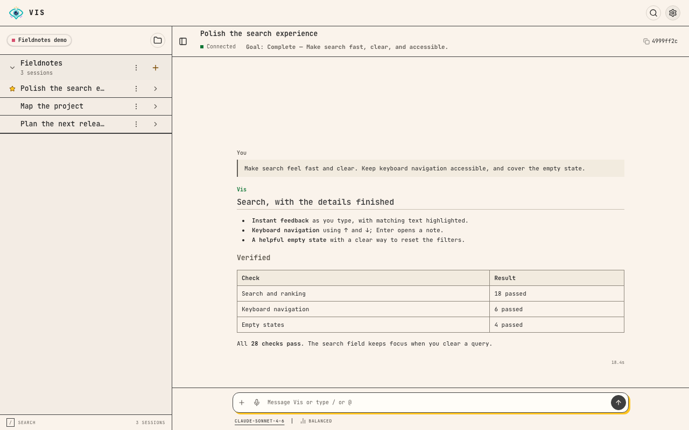
    </a>
    <figcaption>Desktop · Conversation</figcaption>
  </figure>

  <figure class="screenshot-gallery__slide" id="ios-gallery" role="group" aria-roledescription="slide" aria-label="2 of 9">
    <a class="screenshot-gallery__image" href="assets/screenshots/ios-conversation.png" aria-label="Open full-size screenshot: iOS · Conversation">
      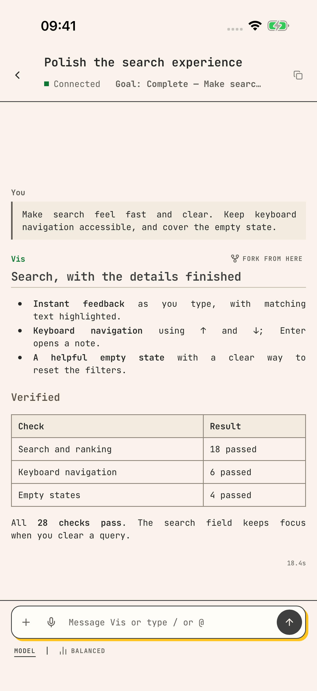
    </a>
    <figcaption>iOS · Conversation</figcaption>
  </figure>

  <figure class="screenshot-gallery__slide" id="tui-gallery" role="group" aria-roledescription="slide" aria-label="3 of 9">
    <a class="screenshot-gallery__image" href="assets/screenshots/tui-conversation.png" aria-label="Open full-size screenshot: TUI · Conversation">
      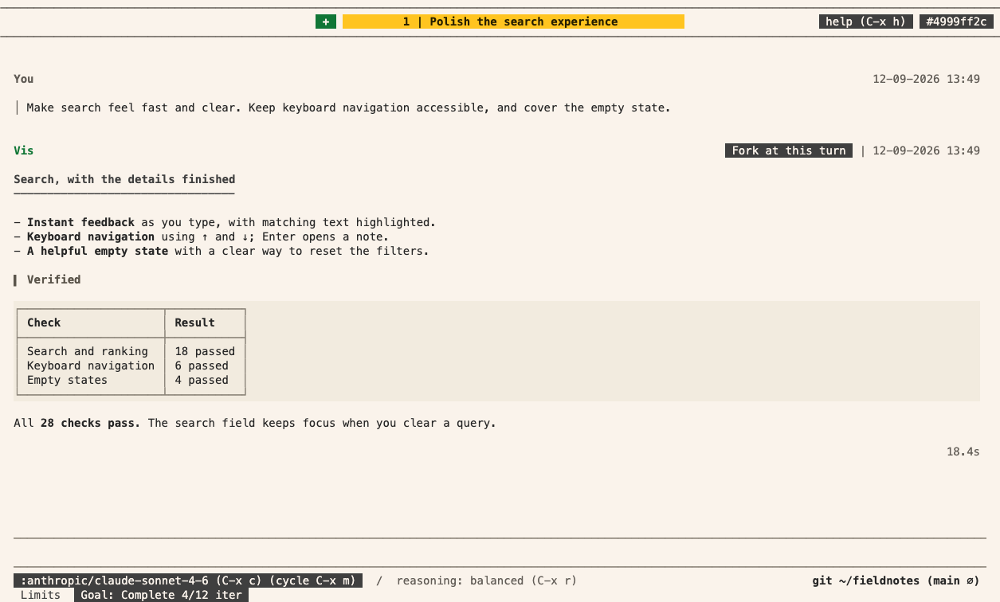
    </a>
    <figcaption>TUI · Conversation</figcaption>
  </figure>

  <figure class="screenshot-gallery__slide" role="group" aria-roledescription="slide" aria-label="4 of 9">
    <a class="screenshot-gallery__image" href="assets/screenshots/desktop-project.png" aria-label="Open full-size screenshot: Desktop · Project tour">
      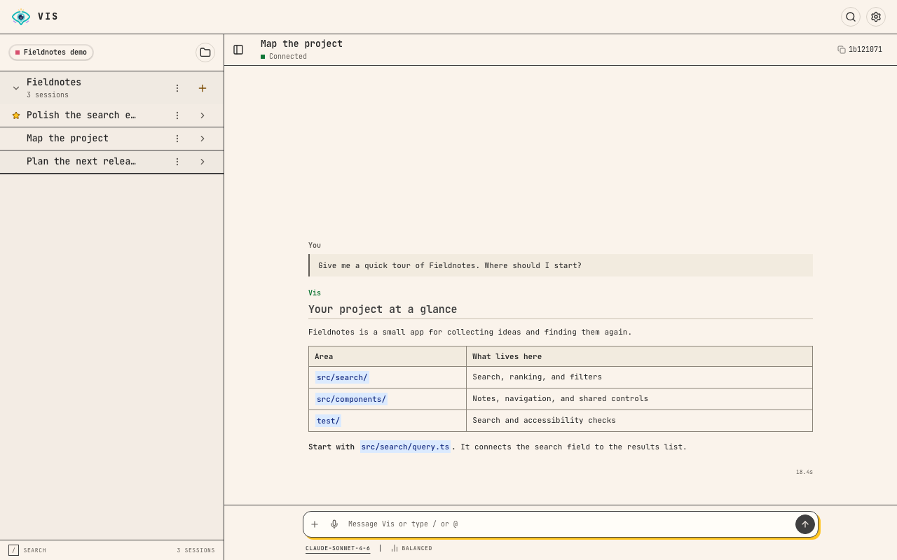
    </a>
    <figcaption>Desktop · Project tour</figcaption>
  </figure>

  <figure class="screenshot-gallery__slide" role="group" aria-roledescription="slide" aria-label="5 of 9">
    <a class="screenshot-gallery__image" href="assets/screenshots/ios-project.png" aria-label="Open full-size screenshot: iOS · Project tour">
      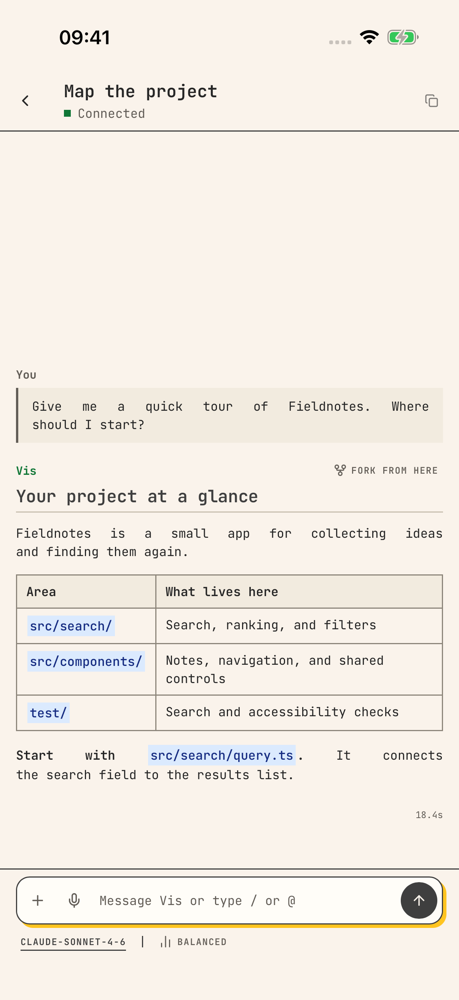
    </a>
    <figcaption>iOS · Project tour</figcaption>
  </figure>

  <figure class="screenshot-gallery__slide" role="group" aria-roledescription="slide" aria-label="6 of 9">
    <a class="screenshot-gallery__image" href="assets/screenshots/tui-project.png" aria-label="Open full-size screenshot: TUI · Project tour">
      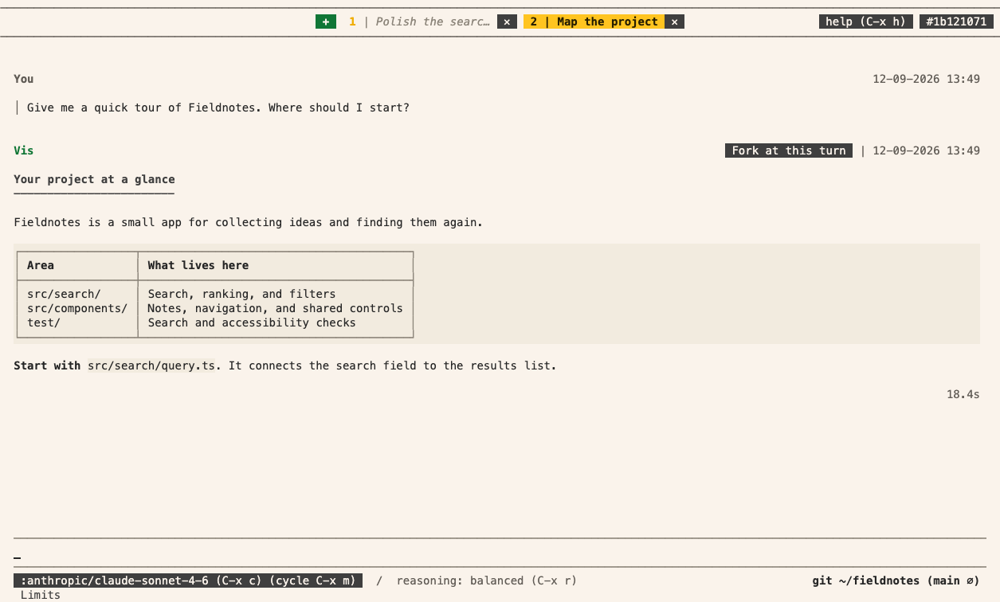
    </a>
    <figcaption>TUI · Project tour</figcaption>
  </figure>

  <figure class="screenshot-gallery__slide" role="group" aria-roledescription="slide" aria-label="7 of 9">
    <a class="screenshot-gallery__image" href="assets/screenshots/desktop-release.png" aria-label="Open full-size screenshot: Desktop · Release checklist">
      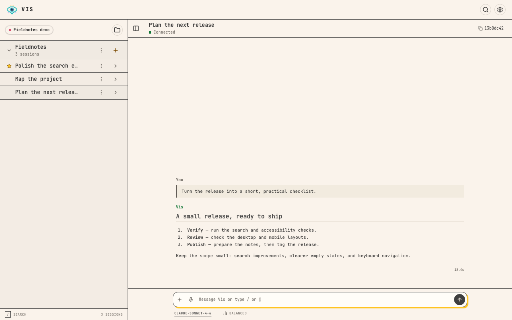
    </a>
    <figcaption>Desktop · Release checklist</figcaption>
  </figure>

  <figure class="screenshot-gallery__slide" role="group" aria-roledescription="slide" aria-label="8 of 9">
    <a class="screenshot-gallery__image" href="assets/screenshots/ios-sessions.png" aria-label="Open full-size screenshot: iOS · Sessions">
      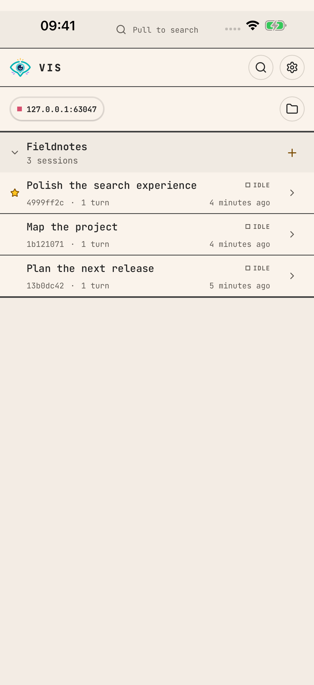
    </a>
    <figcaption>iOS · Sessions</figcaption>
  </figure>

  <figure class="screenshot-gallery__slide" role="group" aria-roledescription="slide" aria-label="9 of 9">
    <a class="screenshot-gallery__image" href="assets/screenshots/tui-sessions.png" aria-label="Open full-size screenshot: TUI · Session navigator">
      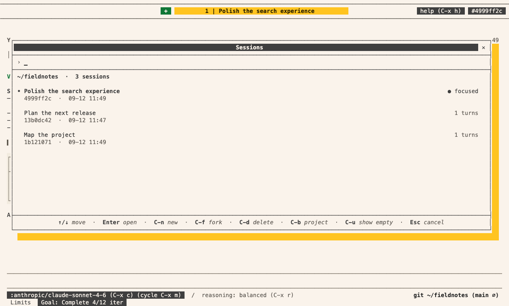
    </a>
    <figcaption>TUI · Session navigator</figcaption>
  </figure>

  </div>

  <div class="screenshot-gallery__controls" hidden>
    <button type="button" data-previous aria-controls="screenshot-slides" aria-label="Previous screenshot">← Previous</button>
    <span role="status" aria-live="polite" aria-atomic="true">1 / 9</span>
    <button type="button" data-next aria-controls="screenshot-slides" aria-label="Next screenshot">Next →</button>
  </div>
</section>

## Gateway reference

<span id="starting-the-gateway"></span>
<span id="using-a-remote-gateway-from-the-cli"></span>
<span id="tokens-and-http-401"></span>
<span id="http-api"></span>
<span id="python-sdk"></span>
<span id="resource-limits"></span>

For remote connections, tokens and service setup, see [Running a gateway](gateway-service.md). To
use Vis from your own code, see [Python SDK basics](python-sdk.md) or [HTTP API basics](http-api.md).

<span id="see-also"></span>

## Learn more

<span id="work-with-a-project"></span>
<span id="follow-the-work-on-every-screen"></span>
<span id="keep-useful-work-when-you-return"></span>
<span id="why-vis"></span>

### Intro

- [Rationale](rationale.md) — the reasons behind the design of Vis.
- [Running a gateway](gateway-service.md) — install and operate a shared agent service.
- [Reporting a bug](reporting-bugs.md) — report a problem without exposing private data.

### Concepts

Each concept page explains one feature: what it does, when to use it and how to start.

- [Sessions](sessions.md) — continue, stop or find your work.
- [Context management](context-management.md) — how filtering and summaries keep conversations manageable.
- [Project instructions](project-instructions.md) — tell the agent how your codebase works.
- [Skills](skills.md) — reusable task instructions.
- [Drafts](drafts.md) — review changes in a separate working copy.
- [Council](council.md) — ask another session for help or a second review.
- [Automations](automations.md) — run a prompt on a schedule or from a webhook.
- [Forms and user input](human-input.md) — ask for choices, credentials or confirmation.
- [Live views](live-views.md) — show progress a person can watch and stop.
- [Python sandbox](python-sandbox.md) — Python execution, packages and permissions.
- [Configuration](configuration.md) — providers, models and project settings.
- [Decision models](decision-models.md) — download Laya, train and publish FP32 versions.

### Programmatic access

Use these pages to drive the same features from your own code. Start with the basics page for
Python or for HTTP. Then read the API page for the feature. Each API page shows the Python examples.
To see the same steps as HTTP requests, select **HTTP** at the top of the page.

**Basics**

- [Python SDK basics](python-sdk.md) — install the SDK, run a private agent and connect to a gateway.
- [HTTP API basics](http-api.md) — authenticate requests, read the OpenAPI document and handle errors.
- [Extension API](extension-api.md) — declarations, tool contracts and host operations for extensions.

**Feature APIs**

- [Sessions API](sessions-api.md) — sessions, messages, progress and saved work from Python or HTTP.
- [Context management API](context-management-api.md) — context budget, usage and cache health from Python or HTTP.
- [Project instructions API](project-instructions-api.md) — prompt templates, skills and goals from Python or HTTP.
- [Drafts API](drafts-api.md) — draft settings and draft state from Python or HTTP.
- [Council API](council-api.md) — Council messages, wakes and rooms from Python or HTTP.
- [Automations API](automations-api.md) — automations, runs, secrets and webhooks from Python or HTTP.
- [Configuration API](configuration-api.md) — settings and extension reloads from Python or HTTP.

<span id="put-your-expertise-into-code"></span>
<span id="combine-steps-in-python"></span>

### Extensions

- [Extending Vis](extending.md) — choose a capability and build your first tool.
- [Extension design](extension-design.md) — design and test typed tools.
- [Installing and sharing extensions](extension-packages.md) — add an extension or share your own.
- [Using an existing Python project](extension-development.md) — prepare editable uv packages for Vis.
- [Native builds for Java and Clojure extensions](jvm-native-image.md) — add Java or Clojure tools to Vis.
- [Extension troubleshooting](extension-troubleshooting.md) — diagnose loading and call errors.
- [Provider extensions](provider-extensions.md) — register an LLM provider from an extension.

<span id="updating-vis"></span>
<span id="native-vs-jvm"></span>

### Reference

- [Keyboard shortcuts](keyboard-shortcuts.md) — keys for the terminal app.
- [Process jail and network policy](jail.md) — rules for child processes.
- [Runtime distributions](distributions.md) — installation methods and updates.
- [Logs and diagnostics](logging.md) — file locations, formats, retention and sharing.
