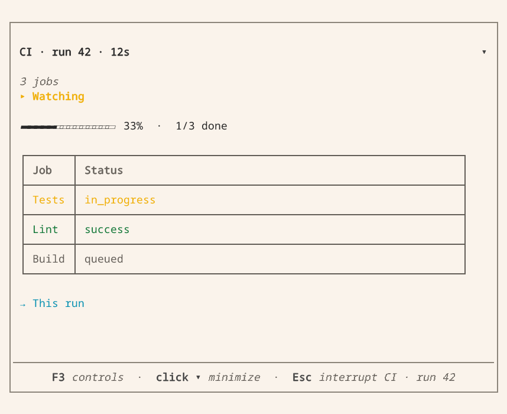
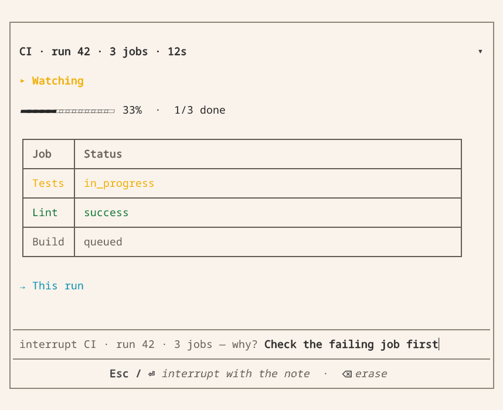

# Live views

A live view lets someone follow a long-running operation, such as a build,
without reading a new chat message for every update. Your extension opens it with
`vis.live(...)` and updates its progress, tables, logs or controls as work proceeds.
The view appears in the terminal or Companion app and can be stopped at any time.

## Before you start

Open a live view inside a registered tool or user command with a calling session,
not during extension registration. Choose [Activity presentation](extension-api.md#activity-presentation)
for a tool's ordinary status; use a live view when the user needs to watch or interact
with ongoing work. Stopping the view stops watching, not necessarily the external job.

## In the terminal

The example below updates a single pane as jobs finish, rather than printing a
new message on every poll. This capture shows example job data in the actual
Vis terminal renderer. Select an image to view it full size.

[](assets/screenshots/live-running.png)

Press F3 for keyboard controls: expand a disclosure, select a row or activate a button.
Press Escape to open the stop confirmation. You can add a note for the agent
before stopping the view; cancelling the confirmation keeps it running.

[](assets/screenshots/live-stop.png)

## Watch a CI run

This implementation belongs in a trusted extension module. Register `watch_run`
with `vis.Symbol` to call it from Vis. It requires the GitHub CLI, authentication
and a working directory inside the target repository; `run_id` is a numeric Actions
run ID. The function returns the final view receipt, not a GitHub run object.
For a complete integration with typed results and error handling, use the
[repository's GitHub extension](https://github.com/Blockether/vis/blob/main/.vis/extensions/gh.py).

```python
import json
import time

import blockether.vis.extension as vis

TONES = {"": "running", "success": "ok", "skipped": "idle"}  # anything else is an error


def poll(run_id):
    done = vis.shell({"op": "background", "id": "gh",
                      "command": f"gh run view {run_id} --json jobs,status,conclusion,url"}).wait(60)
    return json.loads(done["out"])


def watch_run(run_id: int) -> dict:
    """Watch a GitHub Actions run; stopping the view does not cancel the run."""
    run = poll(run_id)
    with vis.live(
        f"CI · run {run_id} · {len(run['jobs'])} jobs",
        [
            vis.status("run", "Watching", tone="running"),
            vis.progress("progress"),
            vis.table("jobs", columns=[vis.table_column("job", "Job"),
                                       vis.table_column("state", "Status")]),
            vis.link("links", links=[{"id": "run", "label": "This run", "target": run["url"]}]),
        ],
    ) as view:
        seen = {}
        counts = None
        while True:
            if view.is_interrupted:
                return view.close(summary="Stopped watching before the run completed")
            for job in run["jobs"]:
                state = job["conclusion"] or job["status"]
                if seen.get(job["databaseId"]) != state:
                    seen[job["databaseId"]] = state
                    view["jobs"].upsert(str(job["databaseId"]), [job["name"], state],
                                        tone=TONES.get(job["conclusion"], "error"))
            completed = sum(1 for j in run["jobs"] if j["status"] == "completed")
            total = len(run["jobs"])
            if total and (completed, total) != counts:
                view["progress"].set(done=completed, total=total)
                counts = (completed, total)
            if run["status"] == "completed":
                break
            deadline = time.monotonic() + 5
            while (remaining := deadline - time.monotonic()) > 0:
                view.sleep(remaining)
                if view.is_interrupted:
                    return view.close(summary="Stopped watching before the run completed")
            run = poll(run_id)
        view["run"].set(run["conclusion"], tone=TONES.get(run["conclusion"], "error"))
        return view.close(summary=f"Run result: {run['conclusion']}")
```

GitHub may return a run before publishing its jobs. Declare progress without a
`total` while the count is unknown; `total=0` is invalid. Set both `done` and
`total` when jobs appear, and update the total if more jobs are added. The example
keeps the last known counts across later empty polls.


## Monitor a fixed build set

Use one synchronous tool and one live view to observe several **already selected**
builds. The coordinator below runs at most two read-only requests concurrently,
consumes completed reads without waiting for a slower peer, and retains each
build's last observation. It does not launch deployments, schedule dependencies,
or cancel remote jobs. General model shell access is not needed.

Supply a domain adapter `read_once(build, *, deadline, stop)` that returns
`"running"`, `"succeeded"` or `"failed"` for that exact environment and build ID.
This adapter is your CI client's code, **not a Vis API**. It must:

- Use pinned identities, not a moving alias such as “latest”.
- Enforce the absolute `time.monotonic()` deadline across connection, reads,
  retries and pagination, and cooperate with the `threading.Event` named `stop`.
- Close responses, sockets and any per-request client in `finally` or `with`.
- Perform reads only. Keep authentication in the trusted extension's configuration;
  do not return credentials or raw exception messages.
- Avoid Vis host calls from the reader threads. Only the invoking thread owns
  and updates the view.

A socket read timeout alone is not a total request deadline. Python cannot forcibly
stop a running thread; use a client with bounded operations and test its cleanup.
The example deliberately accepts this adapter rather than claiming a generic HTTP
`timeout=` guarantees it.

```python
# monitor.py
import math
import time
from concurrent.futures import ThreadPoolExecutor
from dataclasses import asdict, dataclass
from threading import Event

import blockether.vis.extension as vis


@dataclass(frozen=True)
class Build:
    environment: str
    build_id: str


def watch_builds(builds, read_once, *, timeout_s=600.0, poll_s=5.0):
    """Observe a fixed set; return after all locally owned readers have stopped."""
    builds = tuple(builds)
    if not builds or len(set(builds)) != len(builds):
        raise ValueError("Choose a nonempty set of distinct environment/build pairs")
    if any(not b.environment.strip() or not b.build_id.strip() for b in builds):
        raise ValueError("Environment and build ID must be explicit")
    if any(not math.isfinite(n) or n <= 0 for n in (timeout_s, poll_s)):
        raise ValueError("Timeout and poll interval must be finite and positive")
    last = [{**asdict(b), "state": "unobserved", "read_error": None} for b in builds]
    due = [0.0] * len(builds)
    pending = {}
    stop = Event()
    deadline = time.monotonic() + timeout_s
    outcome = "completed"
    with vis.live("Watch builds", [
        vis.status("status", "Watching pinned builds", tone="running"),
        vis.table("builds", columns=[vis.table_column("environment", "Environment"),
                                    vis.table_column("build", "Build"),
                                    vis.table_column("state", "Last observation")]),
    ]) as view:
        pool = ThreadPoolExecutor(max_workers=2, thread_name_prefix="ci-reader")
        try:
            for i, row in enumerate(last):
                view["builds"].upsert(str(i), [row["environment"], row["build_id"],
                                              row["state"]])
            while True:
                if view.is_interrupted:
                    outcome = "interrupted"
                    break
                # Never call result() on an unfinished future or use ordered map().
                for future in [f for f in pending if f.done()]:
                    i = pending.pop(future)
                    try:
                        state = future.result()
                        if state not in {"running", "succeeded", "failed"}:
                            raise ValueError("Unknown build state")
                        last[i]["state"] = state
                    except Exception as error:
                        # A read error is not a failed CI build or a successful read.
                        last[i]["read_error"] = type(error).__name__
                    due[i] = time.monotonic() + poll_s
                    row = last[i]
                    view["builds"].upsert(str(i), [row["environment"], row["build_id"],
                                                  row["read_error"] or row["state"]])
                if any(row["state"] == "failed" for row in last):
                    outcome = "failed"
                    break
                if any(row["read_error"] for row in last):
                    outcome = "observation_error"
                    break
                if all(row["state"] == "succeeded" for row in last):
                    break
                now = time.monotonic()
                if now >= deadline:
                    outcome = "timeout"
                    break
                for i, build in enumerate(builds):
                    if len(pending) == 2:
                        break
                    if (i not in pending.values() and due[i] <= now
                            and last[i]["state"] != "succeeded"):
                        pending[pool.submit(read_once, build,
                                            deadline=min(deadline, now + 5.0),
                                            stop=stop)] = i
                # Futures do not wake the view. Check them within 100 ms; Stop
                # wakes this host wait immediately. UI events do not reset due[].
                view.sleep(min(0.1, max(0.0, deadline - time.monotonic())))
        except vis.Interrupted:
            # Stop can race with any view update, not just the explicit flag read.
            outcome = "interrupted"
        except BaseException:
            outcome = "failed"
            raise
        finally:
            stop.set()
            try:
                reason = "failed" if outcome == "observation_error" else outcome
                receipt = view.close(reason=reason, summary=f"Monitor: {outcome}")
            finally:
                pool.shutdown(wait=True, cancel_futures=True)
        if receipt["reason"] == "interrupted":
            outcome = "interrupted"  # a concurrent human Stop takes precedence
    return {"outcome": outcome, "observations": last, "view": receipt}
```

Register only the typed wrapper, not the callback-taking coordinator. For example,
with `monitor.py` and your domain client installed in the extension's
[project environment](extension-development.md#prepare-the-project-environment):

```python
# .vis/extensions/ci_monitor.py
import blockether.vis.extension as vis
from monitor import Build, watch_builds
from my_ci import read_build  # your bounded, read-only adapter described above


def watch(builds: list[Build], timeout_s: float = 600.0) -> dict:
    """Watch these exact builds together. Stop watching never cancels remote jobs."""
    return watch_builds(builds, read_build, timeout_s=timeout_s)


def present(*, phase, args, kwargs, result, error):
    if phase == "start":
        summary = "Watching the selected build set"
    elif phase == "failure":
        summary = f"Monitoring could not finish: {type(error).__name__}"
    else:
        summary = f"{result['outcome']}: {len(result['observations'])} builds"
    return vis.ActivityPresentation("Watch builds", summary)


vis.register(vis.Extension(
    name="ci-monitor", alias="ci", description="Read-only monitoring of pinned CI builds.",
    symbols=[vis.Symbol(watch, name="watch_builds",
                        activity=vis.Activity(label="Watch builds", render=present))],
))
```

**Fail-fast and cleanup are separate.** Once a completed read reports failure,
no new work is scheduled and the view closes before joining slower readers.
The caller returns only after those readers finish their bounded cleanup;
`Future.cancel()` cannot kill an in-flight request. Do not replace this with
`shutdown(wait=False)` and silently leave work running after return. Snapshots
are the last observations consumed before stopping; `unobserved` does not mean
running or successful, and late results during cleanup do not overwrite them.

**This is not durable background execution.** The open live view suspends the
invoking block's ordinary wall-time limit, not network deadlines or the recipe's
explicit overall timeout. A synchronous call still occupies its caller: the
model cannot call a second “stop” tool on that same blocked call. Use the UI or
an independent SDK client. There is no monitoring after return and no recovery
across a worker or gateway restart.

Before shipping your adapter, test a fast failure beside a slow read, successful
completion, Stop during waiting and updating, request errors, the overall timeout,
and release of every locally owned thread and response. The repository's
[recipe tests](https://github.com/Blockether/vis/blob/main/packages/vis-agent/tests/test_monitor_recipe.py)
execute these code blocks with controlled readers and `LiveRecorder`; they do not
verify your CI service or credentials.

## Nodes

A view declares its nodes once, each with an id, and addresses them by id.
`view[id]` returns a typed handle with only the verbs its node type supports:

| Builder | Shows | Verbs on `view[id]` |
| --- | --- | --- |
| `vis.status(id, text, tone=…, detail=…)` | one line | `.set(text, tone=, detail=, label=)` |
| `vis.progress(id, total=…)` | a bar | `.set(value=, done=, total=)` |
| `vis.stat(id, stats=[…])` | a strip of counters | `.set(stat_id, value_text, label=, tone=)`, `.remove(*ids)`, `.clear()` |
| `vis.steps(id, steps=[…])` | a checklist | `.set(step_id, tone=, label=, detail=, value=)`, `.remove(*ids)`, `.clear()` |
| `vis.output(id, label=…, default_expanded=False)` | independently collapsible retained lines | `.write(*lines, tone=)`, `.clear()` |
| `vis.table(id, columns=[vis.table_column(…)])` | rows keyed by id | `.upsert(row_id, cells, tone=, branch=)`, `.select(*row_ids)`, `.remove(*ids)`, `.clear()` |
| `vis.link(id, links=[…])` | links a person can open | `.add(link_id, label, target, target_kind=, tone=)` |
| `vis.paragraph(id, text)` | a paragraph with inline formatting | `.set(text)` |
| `vis.heading(id, text, level=2)` | a heading at level 1–6 | `.set(text, level=)` |
| `vis.code(id, text, language=None)` | literal, whitespace-preserving code | `.set(text, language=)` |
| `vis.spinner(id, text="Working", variant="braille")` | an explicit activity indicator | `.set(text=, variant=, is_active=)` |
| `vis.button(id, label, is_disabled=False)` | an operator action | `.set(label=, is_disabled=)` |
| `vis.disclosure(id, label, *nodes, default_expanded=False)` | a collapsible column | children update by their own ids |

`vis.output(...)` builds a `log` node; it is named `output` so it never shadows
`vis.log`, the engine log line.

Keyed updates insert new ids or update existing ones without changing their
position. Log lines have no ids and are appended. `window_lines` limits the
recent lines retained by a client; `.clear()` removes both displayed and
recorded lines. Every log starts collapsed independently. Expanding one never
opens another; patches preserve the reader's choice. `default_expanded=True`
changes only the initial active state. Completed receipts start collapsed again,
and their retained output remains available when expanded.

Expanded logs offer **Search** in Companion and **Search log** through the TUI's
F3 controls or pointer. Search is a literal substring, case-insensitive, across
the retained record, including lines outside `window_lines` and closed views.
Results include original one-based line numbers and are paged in groups of 200.
They are a snapshot: **Refresh results** includes new output. Clearing a log
resets its searchable history. Search never sends an action to the producer.

In Companion, **Clear search** or Escape in the search field restores normal output; `/` while the
output is focused moves focus to search. Without a record loader, the panel
explicitly limits search to loaded lines. In the TUI, an empty query browses the
record, Enter opens a full wrapped line, and Escape cancels an in-flight read.

The existing `GET /v1/sessions/:sid/views/live/:view-id/log/:node-id` route accepts
`query`, `from` and `limit`. `from` is a zero-based match offset; an empty query
matches all lines. The response includes `lines`, `line_numbers`, `matched` and
`total`. The gateway caps pages at the default log-window size; it streams the
record and retains only the requested result page. Styled pages also include
`line_tones`, aligned with `lines`; a `null` entry means plain text.

### Add severity to streaming output

Use `view["log"].write(..., tone="error")` to distinguish compiler failures,
warnings and successful steps without treating a mixed build log as one source
language. The typed `vis.LogTone` values are `"idle"`, `"running"`, `"ok"`, `"warn"`
and `"error"`. Omitting `tone` keeps the plain-text default. A tone applies to all
lines in that call, not to later calls.

```python
with vis.live("Build output", [vis.output("log", label="Build log")]) as view:
    view["log"].write("10:42:00 INFO $ npm test")
    view["log"].write("10:42:01 WARN cache unavailable", tone="warn")
    view["log"].write("10:42:02 ERROR compiler failed", tone="error")
    view["log"].write("    at compile (src/build.ts:42:7)")
```

Keep severity words in the text so the log also makes sense without color.
TUI and Companion use their theme's semantic colors; plain stderr and Markdown
receipts keep the same readable text. Companion's search results retain colors;
the TUI's search and full-line dialogs provide a plain-text fallback. Completed
live-view receipts retain the style metadata as well as the original line numbers.

Redact secrets **before** calling `write` or seeding `lines`. Engine presentation
redaction is an additional safeguard, not a detector for arbitrary secrets. Styles
are separate metadata: they never divide, hide or replace text before redaction,
search or copying. HTML and URLs in output remain literal, not links or executable
markup. ANSI is not a styling API: C0/C1 controls other than tab and newline are
shown as visible `\uXXXX` text (for example, Escape becomes `\u001b`). Cursor moves,
OSC links, clipboard escapes and color escapes are never executed.

Each argument to `write` is a complete retained line, not a raw network fragment.
Decode and assemble partial lines in your adapter before redacting and appending
them. Successive batches keep their own tones, even when updates are coalesced.
Append incremental output rather than clearing and replacing snapshots. Styling
does not change `window_lines`, retention or search pagination; Companion keeps
one earlier page loaded at a time. Use `vis.code(..., language=...)` for a separate,
known-language snippet, not to reinterpret the mixed log.

For raw wire clients, an `append` operation may carry `tone` only for a log node.
Log snapshots may carry `line_tones`, with one tone or `null` per line. Clojure uses
`:tone` on log append operations and `:line-tones` on seeded log nodes. These
closed enums accept no CSS, arbitrary color values, HTML or terminal commands.

### Add spinners and buttons

Spinner variants are `braille`, `dots`, `line` and `pulse`. Set `is_active=False`
to stop one without removing its text. Completed receipts never animate, and the
app respects reduced-motion preferences.

Buttons are real actions, not links or serialized callbacks. An accepted press
increments that node's `clicks` in shared state and wakes `view.sleep(...)`.
Read it with `view.state()`, then let the producer decide what to do. Disabled
buttons and completed receipts reject activation. Treat an unconfirmed network
request as uncertain: check state before retrying a consequential action.

```python
with vis.live("Review", [
    vis.heading("title", "Build review", level=1),
    vis.paragraph("intro", "Read the output before continuing."),
    vis.code("example", "print('ready')", language="python"),
    vis.spinner("waiting", "Waiting for review", variant="dots"),
    vis.disclosure("details", "Build details",
                   vis.output("tests", label="Test output"),
                   vis.output("build", label="Build output")),
    vis.button("continue", "Continue"),
]) as view:
    view["tests"].write("Tests passed")
    while not view.is_interrupted:
        state = view.state()
        if not state:
            break
        pressed = next(n for n in state["nodes"] if n["id"] == "continue")
        if pressed["clicks"]:
            view["continue"].set(is_disabled=True)
            view["waiting"].set("Review accepted", is_active=False)
            break
        view.sleep(60)
```

With one argument, `vis.heading(text)` and `vis.paragraph(text)` remain form
decorations. Two positional arguments declare addressed live nodes. The Clojure
builders in `com.blockether.vis.view` expose the same primitives, using kebab-case
option keys; `disclosure` takes a vector of children and optional options, and
`log` is the Clojure name of Python's `output`.

Tables support `order="insertion"` (default), `"newest-first"` or
`{"by": "duration", "dir": "desc"}`. Rows sharing a `branch="Release apps"`
appear under one collapsible parent. With `is_selectable=True`, users can
select rows; read the selection with `view.state()`.

When a view has exactly one node of a type, its verb is available on the view
itself: `view.status(...)`, `view.progress(...)`, `view.write(...)`,
`view.row(...)`. Add nodes with `view.add(node, after=id)` and remove them with
`view.drop(id)`.

## Layout and text

`vis.row(id, *nodes)` and `vis.column(id, *nodes)` arrange nodes horizontally
or vertically. Every group has an id. Rows place children side by side when
space permits and vertically on narrow screens. `view.add(node, after="hosts")`
inserts into the group containing `hosts`. Removing a group removes its
children.

Display text accepts inline Markdown: `` `code` ``, `**bold**`, `_italic_` and
links. Status text wraps and is justified within its column.
Log lines and code blocks are never executed. Log terminal controls display as visible escapes;
other text stays literal. There is no arbitrary Markdown node; each node type has its own Markdown output.

## Updating

- `view.sleep(seconds)` blocks in the host until the view changes, closes or the
  timeout expires. It returns `True` for a change or close, `False` for a timeout.
  There is no periodic state polling while it waits, and an unchanged timeout
  returns no view payload. Use it instead of `time.sleep` in view loops.
- Waiting does not publish view updates or activity. Send only changed data;
  external services still need their own polling interval. A click or Stop
  should not trigger another GitHub request.
  The example keeps a five-second deadline even when a view event wakes it early.
- Wait durations must be finite and at most 86400 seconds. Nonpositive durations
  return `False` without a host call.
- `with view.batch(): ...` sends multiple node changes as one patch.
- The first update is sent immediately. Further updates within `flush_ms`
  (100 ms by default) are batched. Set the interval with
  `vis.live(..., flush_ms=…)`. Reads and `view.close(...)` flush pending updates.
- An open live view suspends the invoking block's ordinary wall-time limit.
  Set explicit deadlines for external requests and for monitoring as a whole,
  and close the view when work ends. This is not a durable worker lifetime.

## Interruption

The user can stop watching at any time. In the terminal, `Escape` opens a
stop confirmation with an optional note. `Escape` or `Enter` confirms;
`Backspace` on an empty line resumes watching. The Companion app's Interrupt
button opens the same input.

- `view.is_interrupted` is true if the view ended without the extension closing
  it. Reading it uses at most one host call per batching interval.
- `view.is_from_human` indicates a user-initiated stop. `view.note` contains
  their note or `None`.
- Updating an ended view raises `vis.Interrupted` with the note, even if the
  loop does not check the flag.
- From the producer, `view.close(reason="interrupted", summary="Stopped monitoring")`
  closes the owned view; it does not kill threads or remote jobs.
- From an independent SDK client, list `sdk_session.live_views()` and call
  `sdk_session.view_action(view_id, "interrupt", note="Stop monitoring")`. The
  action is `interrupt`, not `cancel`. The producer must still handle
  `view.is_interrupted` or `vis.Interrupted` and clean up its resources.

## Closing

`view.close(reason=…, summary=…, error=…, artifact_id=…, selection_snapshots=…,
model_result=…)` ends the view and returns `is_completed`, `reason`,
`is_from_human`, `note`, the final view state and `summary`. In Vis, the
model's returned view is budgeted. Clients and saved artifacts preserve the
group hierarchy and the current log window.

- `model_result` replaces the model's result with a string. Clients and the
  saved artifact still receive the full view state. A concurrent user stop
  takes precedence and returns an interruption result.
- Repeated closes return the first result. Exiting a context manager closes
  the view; an exception closes it with reason `failed`.
- `selection_snapshots` stores alternate states for selectable rows in the
  artifact, so users can inspect them after the extension exits. The limit is
  500 snapshots and 1 MiB.

## Testing a view

Outside Vis, a live view writes its transcript to stderr and maintains the
same state. `vis.testing.LiveRecorder` records updates and simulates user
actions:

```python
import blockether.vis.extension as vis

recorder = vis.testing.LiveRecorder(vis._host)
monkeypatch.setattr(vis, "_host", recorder)

run_extension()
recorder.select("jobs", ["macos"])       # a human action
assert recorder.node("jobs")["selected_ids"] == ["macos"]
assert recorder.patched()                # ops the extension emitted
result = recorder.close(reason="interrupted")
```

`recorder.ops()` returns the recorded operations for comparison with expected
output. `vis.testing.assert_tree(actual, expected)` reports nested differences.

## See also

- [Extending Vis](extending.md) — the extension that opens a view.
- [Forms and user input](human-input.md) — the same layout builders, used for questions.
