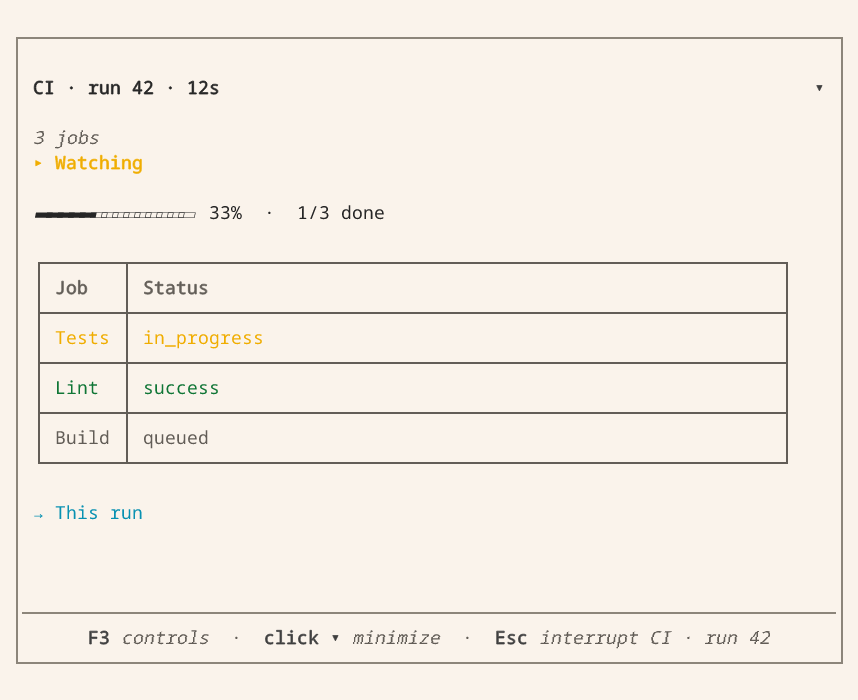
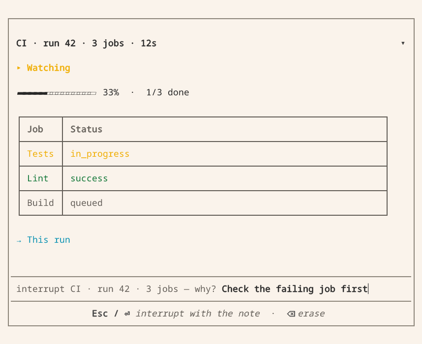

# Live views

A live view lets someone follow a long-running operation, such as a build,
without reading a new chat message for every update. Your extension opens it with
`vis.live(...)` and updates its progress, tables, logs or controls as work proceeds.
The view appears in the terminal or Companion app and can be stopped at any time.

## When to use

- **Your tool waits for a CI run or deployment that takes minutes.** Show its jobs
  as they finish, as in [Watch a CI run](#watch-a-ci-run).
- **You want a dashboard for several builds at once.** Keep them in [one
  view](#monitor-a-fixed-build-set) instead of one message per update.
- **Errors get lost in a long log.** [Mark each line's
  severity](#add-severity-to-streaming-output) so failures stand out.
- **The person watching needs to act or stop.** Add
  [buttons](#add-spinners-and-buttons), and handle [interruption](#interruption)
  when they stop watching.
- **Your own program must list, read or interrupt live views.** Use the [Python
  SDK](#python-sdk) or the [HTTP API](#http-api). Both have the same operations.

For a tool's ordinary status, choose [Activity
presentation](extension-api.md#activity-presentation) instead. Use a live view when
the user needs to watch or interact with ongoing work. To ask a question and wait
for the answer, use a [form](human-input.md).

## Before you start

Open a live view inside a registered tool or user command with a calling session,
not during extension registration. Stopping the view stops watching, not necessarily
the external job.

## In the terminal

The example below updates a single pane as jobs finish. Select the image to view
it full size.

[](assets/screenshots/live-running.png)

Press F3 for keyboard controls: expand a disclosure, select a row or activate a button.
Press Escape to open the stop confirmation. You can add a note for the agent
before stopping the view. Cancelling the confirmation keeps it running.

[](assets/screenshots/live-stop.png)

## Watch a CI run

This implementation belongs in a trusted extension module. Register `watch_run`
with `vis.Symbol` to call it from Vis. It requires the GitHub CLI, authentication
and a working directory inside the target repository. `run_id` is a numeric Actions
run ID. The function returns the final view receipt, not a GitHub run object.
For a complete integration with typed results and error handling, use the
[repository's GitHub extension](https://github.com/Blockether/vis/blob/main/.vis/extensions/gh.py).

```python
import json
import time

import blockether.vis.extension as vis

TONES = {"": "running", "success": "ok", "skipped": "idle"}  # anything else is an error


def poll(run_id):
    done = vis.shell({"op": "background", "id": "gh",
                      "command": f"gh run view {run_id} --json jobs,status,conclusion,url"}).wait(60)
    return json.loads(done["out"])


def watch_run(run_id: int) -> dict:
    """Watch a GitHub Actions run; stopping the view does not cancel the run."""
    run = poll(run_id)
    with vis.live(
        f"CI · run {run_id} · {len(run['jobs'])} jobs",
        [
            vis.status("run", "Watching", tone="running"),
            vis.progress("progress"),
            vis.table("jobs", columns=[vis.table_column("job", "Job"),
                                       vis.table_column("state", "Status")]),
            vis.link("links", links=[{"id": "run", "label": "This run", "target": run["url"]}]),
        ],
    ) as view:
        seen = {}
        counts = None
        while True:
            if view.is_interrupted:
                return view.close(summary="Stopped watching before the run completed")
            for job in run["jobs"]:
                state = job["conclusion"] or job["status"]
                if seen.get(job["databaseId"]) != state:
                    seen[job["databaseId"]] = state
                    view["jobs"].upsert(str(job["databaseId"]), [job["name"], state],
                                        tone=TONES.get(job["conclusion"], "error"))
            completed = sum(1 for j in run["jobs"] if j["status"] == "completed")
            total = len(run["jobs"])
            if total and (completed, total) != counts:
                view["progress"].set(done=completed, total=total)
                counts = (completed, total)
            if run["status"] == "completed":
                break
            deadline = time.monotonic() + 5
            while (remaining := deadline - time.monotonic()) > 0:
                view.sleep(remaining)
                if view.is_interrupted:
                    return view.close(summary="Stopped watching before the run completed")
            run = poll(run_id)
        view["run"].set(run["conclusion"], tone=TONES.get(run["conclusion"], "error"))
        return view.close(summary=f"Run result: {run['conclusion']}")
```

GitHub can return a run before it publishes its jobs. While the count is unknown, declare progress
without a `total`. `total=0` is invalid. When jobs appear, set both `done` and `total`. If more jobs
are added, update the total. The example keeps the last known counts across later empty polls.


## Monitor a fixed build set

Use one synchronous tool and one live view to observe several **already selected** builds. The
coordinator below runs at most two read-only requests at the same time. It uses each completed read
without waiting for a slower one, and it keeps the last observation of each build. It does not
launch deployments, schedule dependencies, or cancel remote jobs. The model does not need general
shell access.

Supply a domain adapter `read_once(build, *, deadline, stop)` that returns
`"running"`, `"succeeded"` or `"failed"` for that exact environment and build ID.
This adapter is your CI client's code, **not a Vis API**. It must:

- Use pinned identities, not a moving alias such as “latest”.
- Enforce the absolute `time.monotonic()` deadline across connection, reads,
  retries and pagination, and cooperate with the `threading.Event` named `stop`.
- Close responses, sockets and any per-request client in `finally` or `with`.
- Make only read requests. Keep authentication in the trusted extension's configuration. Do not
  return credentials or raw exception messages.
- Avoid Vis host calls from the reader threads. Only the invoking thread owns
  and updates the view.

A socket read timeout alone is not a total request deadline. Python cannot forcibly
stop a running thread. Use a client with bounded operations and test its cleanup.

```python
# monitor.py
import math
import time
from concurrent.futures import ThreadPoolExecutor
from dataclasses import asdict, dataclass
from threading import Event

import blockether.vis.extension as vis


@dataclass(frozen=True)
class Build:
    environment: str
    build_id: str


def watch_builds(builds, read_once, *, timeout_s=600.0, poll_s=5.0):
    """Observe a fixed set; return after all locally owned readers have stopped."""
    builds = tuple(builds)
    if not builds or len(set(builds)) != len(builds):
        raise ValueError("Choose a nonempty set of distinct environment/build pairs")
    if any(not b.environment.strip() or not b.build_id.strip() for b in builds):
        raise ValueError("Environment and build ID must be explicit")
    if any(not math.isfinite(n) or n <= 0 for n in (timeout_s, poll_s)):
        raise ValueError("Timeout and poll interval must be finite and positive")
    last = [{**asdict(b), "state": "unobserved", "read_error": None} for b in builds]
    due = [0.0] * len(builds)
    pending = {}
    stop = Event()
    deadline = time.monotonic() + timeout_s
    outcome = "completed"
    with vis.live("Watch builds", [
        vis.status("status", "Watching pinned builds", tone="running"),
        vis.table("builds", columns=[vis.table_column("environment", "Environment"),
                                    vis.table_column("build", "Build"),
                                    vis.table_column("state", "Last observation")]),
    ]) as view:
        pool = ThreadPoolExecutor(max_workers=2, thread_name_prefix="ci-reader")
        try:
            for i, row in enumerate(last):
                view["builds"].upsert(str(i), [row["environment"], row["build_id"],
                                              row["state"]])
            while True:
                if view.is_interrupted:
                    outcome = "interrupted"
                    break
                # Never call result() on an unfinished future or use ordered map().
                for future in [f for f in pending if f.done()]:
                    i = pending.pop(future)
                    try:
                        state = future.result()
                        if state not in {"running", "succeeded", "failed"}:
                            raise ValueError("Unknown build state")
                        last[i]["state"] = state
                    except Exception as error:
                        # A read error is not a failed CI build or a successful read.
                        last[i]["read_error"] = type(error).__name__
                    due[i] = time.monotonic() + poll_s
                    row = last[i]
                    view["builds"].upsert(str(i), [row["environment"], row["build_id"],
                                                  row["read_error"] or row["state"]])
                if any(row["state"] == "failed" for row in last):
                    outcome = "failed"
                    break
                if any(row["read_error"] for row in last):
                    outcome = "observation_error"
                    break
                if all(row["state"] == "succeeded" for row in last):
                    break
                now = time.monotonic()
                if now >= deadline:
                    outcome = "timeout"
                    break
                for i, build in enumerate(builds):
                    if len(pending) == 2:
                        break
                    if (i not in pending.values() and due[i] <= now
                            and last[i]["state"] != "succeeded"):
                        pending[pool.submit(read_once, build,
                                            deadline=min(deadline, now + 5.0),
                                            stop=stop)] = i
                # Futures do not wake the view. Check them within 100 ms; Stop
                # wakes this host wait immediately. UI events do not reset due[].
                view.sleep(min(0.1, max(0.0, deadline - time.monotonic())))
        except vis.Interrupted:
            # Stop can race with any view update, not just the explicit flag read.
            outcome = "interrupted"
        except BaseException:
            outcome = "failed"
            raise
        finally:
            stop.set()
            try:
                reason = "failed" if outcome == "observation_error" else outcome
                receipt = view.close(reason=reason, summary=f"Monitor: {outcome}")
            finally:
                pool.shutdown(wait=True, cancel_futures=True)
        if receipt["reason"] == "interrupted":
            outcome = "interrupted"  # a concurrent human Stop takes precedence
    return {"outcome": outcome, "observations": last, "view": receipt}
```

Register only the typed wrapper, not the callback-taking coordinator. For example,
with `monitor.py` and your domain client installed in the extension's
[project environment](extension-development.md#prepare-the-project-environment):

```python
# .vis/extensions/ci_monitor.py
import blockether.vis.extension as vis
from monitor import Build, watch_builds
from my_ci import read_build  # your bounded, read-only adapter described above


def watch(builds: list[Build], timeout_s: float = 600.0) -> dict:
    """Watch these exact builds together. Stop watching never cancels remote jobs."""
    return watch_builds(builds, read_build, timeout_s=timeout_s)


def present(*, phase, args, kwargs, result, error):
    if phase == "start":
        summary = "Watching the selected build set"
    elif phase == "failure":
        summary = f"Monitoring could not finish: {type(error).__name__}"
    else:
        summary = f"{result['outcome']}: {len(result['observations'])} builds"
    return vis.ActivityPresentation("Watch builds", summary)


vis.register_extension(vis.Extension(
    name="ci-monitor", alias="ci", description="Read-only monitoring of pinned CI builds.",
    symbols=[vis.Symbol(watch, name="watch_builds",
                        activity=vis.Activity(label="Watch builds", render=present))],
))
```

**Fail-fast and cleanup are separate.** When a completed read reports failure, the coordinator
schedules no new work. The view closes before the coordinator joins slower readers. The caller
returns only after those readers finish their bounded cleanup. `Future.cancel()` cannot kill a
request that is already running.

Do not replace this with `shutdown(wait=False)`. That leaves work running after the return, with no
sign of it. Snapshots are the last observations used before the stop. `unobserved` does not mean
running or successful. Late results during cleanup do not overwrite the snapshots.

**This is not durable background execution.** The open live view suspends the
invoking block's ordinary wall-time limit, not network deadlines or the recipe's
explicit overall timeout. A synchronous call still occupies its caller: the
model cannot call a second “stop” tool on that same blocked call. Use the UI or
an independent SDK client. There is no monitoring after return and no recovery
across a worker or gateway restart.

Before you ship your adapter, test these cases:

- A fast failure beside a slow read.
- Successful completion.
- Stop during waiting and during updating.
- Request errors.
- The overall timeout.
- Release of every locally owned thread and response.

The repository's
[recipe tests](https://github.com/Blockether/vis/blob/main/packages/vis-agent/tests/test_monitor_recipe.py)
run these code blocks with controlled readers and `LiveRecorder`. They do not check your CI service
or credentials.

## Nodes

A view declares its nodes once, each with an id, and addresses them by id.
`view[id]` returns a typed handle with only the verbs its node type supports:

| Builder | Shows | Verbs on `view[id]` |
| --- | --- | --- |
| `vis.status(id, text, tone=…, detail=…)` | status text with an optional detail line | `.set(text, tone=, detail=, label=)` |
| `vis.progress(id, total=…)` | a bar | `.set(value=, done=, total=)` |
| `vis.stat(id, stats=[…])` | a strip of counters | `.set(stat_id, value_text, label=, tone=)`, `.remove(*ids)`, `.clear()` |
| `vis.steps(id, steps=[…])` | a checklist | `.set(step_id, tone=, label=, detail=, value=)`, `.remove(*ids)`, `.clear()` |
| `vis.output(id, label=…, default_expanded=False)` | independently collapsible retained lines | `.write(*lines, tone=)`, `.clear()` |
| `vis.table(id, columns=[vis.table_column(…)], groups=[vis.table_group(…)])` | rows keyed by id, optionally folded into groups | `.upsert(row_id, cells, tone=, parent=)`, `.group(group_id, label=, tone=, order=, is_open=)`, `.select(*row_ids)`, `.remove(*ids)`, `.clear()` |
| `vis.link(id, links=[…])` | links a person can open | `.add(link_id, label, target, target_kind=, tone=)` |
| `vis.paragraph(id, text)` | a paragraph with inline formatting | `.set(text)` |
| `vis.heading(id, text, level=2)` | a heading at level 1–6 | `.set(text, level=)` |
| `vis.divider(id)` | a horizontal rule between sections | none (use `view.add(...)` or `view.drop(id)`) |
| `vis.code(id, text, language=None)` | literal, whitespace-preserving code | `.set(text, language=)` |
| `vis.spinner(id, text="Working", variant="braille")` | an explicit activity indicator | `.set(text=, variant=, is_active=)` |
| `vis.button(id, label, is_disabled=False)` | an operator action | `.set(label=, is_disabled=)` |
| `vis.disclosure(id, label, *nodes, default_expanded=False)` | a collapsible column | children update by their own ids |

`vis.output(...)` builds a `log` node. It is named `output` so it never shadows
`vis.log`, the engine log line.

To update a status without changing its detail, omit `detail`. To remove the
detail line, pass `detail=""`:

```python
view["state"].set("Polling", detail="Waiting for jobs")
view["state"].set("Running")             # Keeps the detail.
view["state"].set("Complete", detail="")  # Clears the detail.
```

Keyed updates insert new ids or update existing ones without changing their position. Log lines have
no ids and are appended. `.clear()` removes both displayed and recorded lines.

Each log starts collapsed and has its own expanded state. Expanding one never opens another. Patches
keep the reader's choice. `default_expanded=True` changes only the first active state. Completed
receipts start collapsed again. When you expand one, its saved output is still there.

A live view shows the whole log. When you open a log, Companion and the TUI both read the record
back to its first line. So they show output that arrived before your surface attached, not only a
count of it. `window_lines` only sets the size of two tails: the tail the model reads and the tail a
client gets when it attaches. It never hides output from you.

While the earlier lines are still loading, one line tells you so. The same line also tells you when
a read fails. Search reaches the record in both cases.

Expanded logs offer **Search** in Companion and **Search log** through the TUI's F3 controls or
pointer. Search finds a literal, case-insensitive substring across the saved record, including lines
outside `window_lines` and closed views. Results include original one-based line numbers and come in
pages of 200. They are a snapshot, and **Refresh results** adds new output. Clearing a log resets
its searchable history. Search never sends an action to the producer.

In Companion, **Clear search** or Escape in the search field restores normal output. `/` while the
output is focused moves focus to search. Without a record loader, the panel
explicitly limits search to loaded lines. In the TUI, an empty query browses the
record, Enter opens a full wrapped line, and Escape cancels an in-flight read.

A client reads the record of a log node in pages with the [Python SDK](#read-a-log-page-in-python)
or the [HTTP API](#read-a-log-page-over-http). A request names the log node and takes `query`, `from`
and `limit`. `from` is a zero-based match offset. An empty query matches all lines.

The response includes `lines`, `line_numbers`, `matched` and `total`. The gateway caps pages at the
default log-window size. It streams the record and keeps only the requested result page. Styled
pages also include `line_tones`, aligned with `lines`. A `null` entry means plain text.

### Add severity to streaming output

Use `view["log"].write(..., tone="error")` to distinguish compiler failures,
warnings and successful steps without treating a mixed build log as one source
language. The typed `vis.LogTone` values are `"idle"`, `"running"`, `"ok"`, `"warn"`
and `"error"`. Omitting `tone` keeps the plain-text default. A tone applies to all
lines in that call, not to later calls.

```python
with vis.live("Build output", [vis.output("log", label="Build log")]) as view:
    view["log"].write("10:42:00 INFO $ npm test")
    view["log"].write("10:42:01 WARN cache unavailable", tone="warn")
    view["log"].write("10:42:02 ERROR compiler failed", tone="error")
    view["log"].write("    at compile (src/build.ts:42:7)")
```

Keep severity words in the text so the log also makes sense without color. TUI and Companion use
their theme's semantic colors. Plain stderr and Markdown receipts keep the same readable text.
Companion's search results keep colors. The TUI's search and full-line dialogs provide a plain-text
fallback. Completed live-view receipts keep the style metadata and the original line numbers.

Redact secrets **before** you call `write` or seed `lines`. Engine presentation redaction is an
extra safeguard. It does not detect every kind of secret. Styles are separate metadata. They never
divide, hide or replace text before redaction, search or copying. HTML and URLs in output stay
literal, not links or executable markup.

ANSI is not a styling API. C0/C1 controls other than tab and newline show as visible `\uXXXX` text
(for example, Escape becomes `\u001b`). Cursor moves, OSC links, clipboard escapes and color escapes
are never executed.

Each argument to `write` is one complete line of the record, not a raw network fragment. In your
adapter, decode and assemble partial lines before you redact and append them. Append incremental
output. Do not clear and replace snapshots.

Successive batches keep their own tones, even when updates are coalesced. Styling does not change
`window_lines`, retention or search pagination. The earlier pages that a surface reads back keep the
tones they were written with. Use `vis.code(..., language=...)` for a separate snippet in a known
language, not to reinterpret the mixed log.

For raw wire clients, an `append` operation can carry `tone` only for a log node. Log snapshots can
carry `line_tones`, with one tone or `null` per line. Clojure uses `:tone` on log append operations
and `:line-tones` on seeded log nodes. These closed enums accept no CSS, free-form color values,
HTML or terminal commands.

### Add spinners and buttons

Spinner variants are `braille`, `dots`, `line` and `pulse`. Set `is_active=False`
to stop one without removing its text. Completed receipts never animate, and the
app respects reduced-motion preferences.

Buttons are real actions, not links or serialized callbacks. An accepted press
increments that node's `clicks` in shared state and wakes `view.sleep(...)`.
Read it with `view.state()`, then let the producer decide what to do. Disabled
buttons and completed receipts reject activation. Treat an unconfirmed network
request as uncertain: check state before retrying a consequential action.

```python
with vis.live("Review", [
    vis.heading("title", "Build review", level=1),
    vis.paragraph("intro", "Read the output before continuing."),
    vis.code("example", "print('ready')", language="python"),
    vis.spinner("waiting", "Waiting for review", variant="dots"),
    vis.disclosure("details", "Build details",
                   vis.output("tests", label="Test output"),
                   vis.output("build", label="Build output")),
    vis.divider("review-actions"),
    vis.button("continue", "Continue"),
]) as view:
    view["tests"].write("Tests passed")
    while not view.is_interrupted:
        state = view.state()
        if not state:
            break
        pressed = next(n for n in state["nodes"] if n["id"] == "continue")
        if pressed["clicks"]:
            view["continue"].set(is_disabled=True)
            view["waiting"].set("Review accepted", is_active=False)
            break
        view.sleep(60)
```

With one argument, `vis.heading(text)` and `vis.paragraph(text)` remain form
decorations. Two positional arguments declare addressed live nodes. The Clojure
builders in `com.blockether.vis.view` expose the same primitives, using kebab-case
option keys. `disclosure` takes a vector of children and optional options, and
`log` is the Clojure name of Python's `output`.

Tables support `order="insertion"` (default), `"newest-first"` or
`{"by": "duration", "dir": "desc"}`. Rows that share a `parent="tests"` appear under one collapsible
group. The group stays closed until the reader opens it. Every surface shows that group the same
way, with its name and the number of rows it holds. So keep the name stable and let Vis do the
counting.

A group that you never declare gets its id as its name. It sorts after the declared groups, in the
order its first row arrived.

Declare a group when you want to name, color or order it. When you build the table, use
`vis.table_group("tests", label="Tests", tone="error", order=0)`. While the run moves, use
`view["jobs"].group("tests", tone="error")`.

Declarations merge by id, so a later call changes only the keys it passes. Renaming a group keeps
the reader's fold. `is_open=True` opens the group when it first arrives. After that, the reader's
own choice stands. A declared group that holds no rows is not shown.

With `is_selectable=True`, users can select rows. Read the selection with
`view.state()`.

When a view has exactly one node of a type, its verb is available on the view
itself: `view.status(...)`, `view.progress(...)`, `view.write(...)`,
`view.row(...)`. To change the layout while a view runs, see
[Layout and text](#layout-and-text).

## Layout and text

Use `vis.row(id, *nodes)` and `vis.column(id, *nodes)` to arrange nodes with
the same row/column layout vocabulary as [Ask forms](human-input.md#layout).
Every Live group has an id. Groups can nest. Each nested group uses the width
available inside its parent, not the full screen width.

In Companion, rows use equal-width columns with a minimum width of `12rem`,
wrapping into fewer columns as space narrows and eventually stacking. A single
column can shrink below that minimum to fit a very narrow panel. In the TUI,
rows use equal-width columns when each child has at least 24 terminal text cells
after spacing. Otherwise the entire row stacks vertically. Columns always stack.

Declare at least one child in every `vis.row`, `vis.column` and
`vis.disclosure`. These Python builders raise `ValueError` immediately when
called without children. If you do not have any nodes yet, wait to add the
group until its first child is available.

Use `view.add(node)` to append a top-level node. With `after=`, the new node
becomes the named node’s next sibling in the same container:

```python
view.add(vis.column("builds", vis.status("linux", "Queued")))
view.add(vis.status("macos", "Queued"), after="linux")  # Inside builds.
view.add(vis.status("summary", "Watching"), after="builds")  # After the group.
```

To grow a group, name one of its children in `after=`, not the group itself.
Remove a node with `view.drop(id)`. Removing a group also removes its children.
Groups preserve their children’s live interactions and do not produce form
answer values.

Use `vis.divider("section-break")` between sections, like an HTML `<hr>`. It fills
its current container’s width in the terminal and Companion, including inside
columns and disclosures, and remains visible in completed receipts. A divider
has only an id: it has no label, content, style options or update verbs. Use a
heading for a section title, and `view.drop("section-break")` to remove the rule.
The Clojure builder is `(view/divider "section-break")`. The wire node is
`{"id": "section-break", "type": "divider"}`.

Display text accepts inline Markdown: `` `code` ``, `**bold**`, `_italic_` and links. Status text
wraps and is justified within its column.

Log lines and code blocks are never executed. Terminal controls in logs show as visible escapes.
Other text stays literal. There is no general Markdown node. Each node type has its own Markdown
output.

## Updating

- `view.sleep(seconds)` blocks in the host until the view changes, closes or the
  timeout expires. It returns `True` for a change or close, `False` for a timeout.
  There is no periodic state polling while it waits, and an unchanged timeout
  returns no view payload. Use it instead of `time.sleep` in view loops.
- Waiting does not publish view updates or activity. Send only changed data.
  External services still need their own polling interval. A click or Stop
  should not trigger another GitHub request.
  The example keeps a five-second deadline even when a view event wakes it early.
- Wait durations must be finite and at most 86400 seconds. Nonpositive durations
  return `False` without a host call.
- `with view.batch(): ...` sends multiple node changes as one patch.
- The first update is sent immediately. Further updates within `flush_ms`
  (100 ms by default) are batched. Set the interval with
  `vis.live(..., flush_ms=…)`. Reads and `view.close(...)` flush pending updates.
- An open live view suspends the invoking block's ordinary wall-time limit.
  Set explicit deadlines for external requests and for monitoring as a whole,
  and close the view when work ends. This is not a durable worker lifetime.

## Interruption

The user can stop watching at any time. In the terminal, `Escape` opens a stop confirmation with an
optional note. `Escape` or `Enter` confirms. `Backspace` on an empty line resumes watching. The
Companion app's Interrupt button opens the same input.

- `view.is_interrupted` is true if the view ended without the extension closing
  it. Reading it uses at most one host call per batching interval.
- `view.is_from_human` is true when the user stopped the view. `view.note` contains
  their note or `None`.
- Updating an ended view raises `vis.Interrupted` with the note, even if the
  loop does not check the flag.
- From the producer, `view.close(reason="interrupted", summary="Stopped monitoring")`
  closes the owned view. It does not kill threads or remote jobs.
- From an independent client, interrupt the view with the [Python
  SDK](#interrupt-a-view-in-python) or the [HTTP API](#interrupt-a-view-over-http). The action is
  `interrupt`, not `cancel`. The producer must still handle `view.is_interrupted` or
  `vis.Interrupted` and clean up its resources.

## Closing

`view.close(reason=…, summary=…, error=…, artifact_id=…, selection_snapshots=…,
model_result=…)` ends the view and returns `is_completed`, `reason`,
`is_from_human`, `note`, the final view state and `summary`. In Vis, the
model's returned view is budgeted. Clients and saved artifacts preserve the
group hierarchy and the current log window.

- `model_result` replaces the model's result with a string. Clients and the
  saved artifact still receive the full view state. A concurrent user stop
  takes precedence and returns an interruption result.
- Repeated closes return the first result. Exiting a context manager closes
  the view. An exception closes it with reason `failed`.
- `selection_snapshots` stores alternate states for selectable rows in the
  artifact, so users can inspect them after the extension exits. The limit is
  500 snapshots and 1 MiB.

## Testing a view

Outside Vis, a live view writes its transcript to stderr and maintains the
same state. `vis.testing.LiveRecorder` records updates and simulates user
actions:

```python
import blockether.vis.extension as vis

recorder = vis.testing.LiveRecorder(vis._host)
monkeypatch.setattr(vis, "_host", recorder)

run_extension()
recorder.select("jobs", ["macos"])       # a human action
assert recorder.node("jobs")["selected_ids"] == ["macos"]
assert recorder.patched()                # ops the extension emitted
result = recorder.close(reason="interrupted")
```

`recorder.ops()` returns the recorded operations for comparison with expected
output. `vis.testing.assert_tree(actual, expected)` reports nested differences.

## Python SDK

`GatewayClient` reads and interrupts the live views of a session. Connect as in [Connect a Python
client](gateway-service.md#connect-a-python-client). The examples are calls on that `client`.

| Task | Method |
|---|---|
| List live views | `get_session_views_live(sid)` |
| Read a page of a log node | `get_session_views_live_log(sid, view_id, node_id, query=...)` |
| Interrupt a view | `post_session_view(sid, view_id, body=...)` |

### List live views in Python

```python
for view in client.session(session_id).live_views():
    print(view.id, view.title, len(view.nodes))
```

`live_views()` returns typed `LiveView` records. `get_session_views_live(session_id)` returns the
same views as JSON in `views`. A list is a snapshot. It does not follow later updates.

### Read a log page in Python

```python
page = client.get_session_views_live_log(
    session_id, view_id, "build/log", query={"query": "error", "from": 0, "limit": 100}
)
for number, line in zip(page["line_numbers"], page["lines"]):
    print(number, line)
```

The method sends the node ID as the `node` query parameter. The answer has `lines`, `line_numbers`,
`matched` and `total`.

### Interrupt a view in Python

```python
client.session(session_id).view_action(view_id, "interrupt", note="Stop monitoring")
```

`view_action` checks the body before it sends it. `post_session_view(session_id, view_id,
body={"action": "interrupt", "note": "Stop monitoring"})` sends the same request without the check.

## HTTP API

The HTTP API has the same operations as the [Python SDK](#python-sdk). The examples use the `vis_api`
function from [Authenticate HTTP requests](gateway-service.md#authenticate-http-requests).

| Task | Method and path |
|---|---|
| List live views | `GET /v1/sessions/{sid}/views/live` |
| Read a page of a log node | `GET /v1/sessions/{sid}/views/live/{view-id}/log` |
| Interrupt a view | `POST /v1/sessions/{sid}/views/{view-id}/actions` |

### List live views over HTTP

```bash
vis_api "$VIS_GATEWAY_URL/v1/sessions/$SESSION_ID/views/live"
```

The answer has `views`. Each view has `id`, `title` and `nodes`. A list is a snapshot. It does not
follow later updates.

### Read a log page over HTTP

```bash
vis_api "$VIS_GATEWAY_URL/v1/sessions/$SESSION_ID/views/live/$VIEW_ID/log?node=build%2Flog&query=error&from=0&limit=100"
```

The `node` query parameter names the log node, because a node ID can contain `/`. Encode `/` as
`%2F`. The answer has `lines`, `line_numbers`, `matched` and `total`.

### Interrupt a view over HTTP

```bash
vis_api -X POST "$VIS_GATEWAY_URL/v1/sessions/$SESSION_ID/views/$VIEW_ID/actions" \
  -H 'content-type: application/json' --data '{"action": "interrupt", "note": "Stop monitoring"}'
```

## See also

- [Extending Vis](extending.md) — the extension that opens a view.
- [Forms and user input](human-input.md) — the same layout builders, used for questions.
